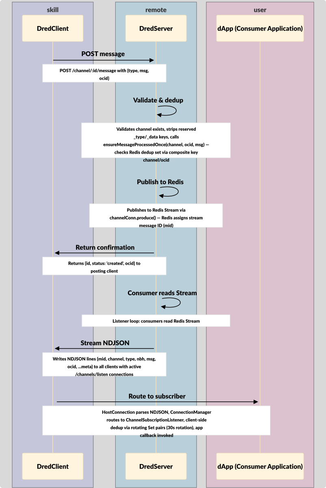
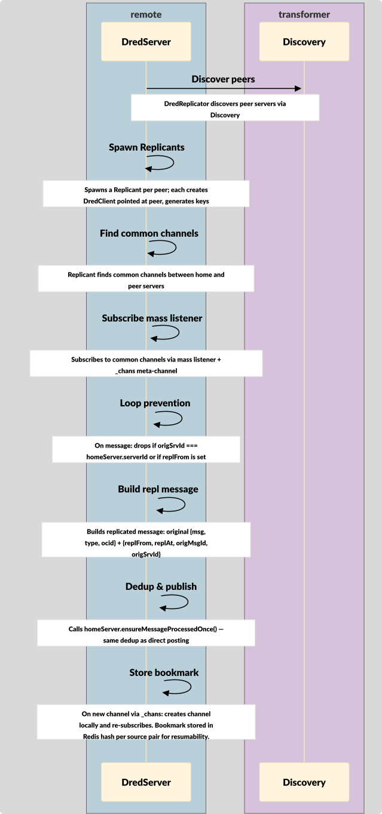
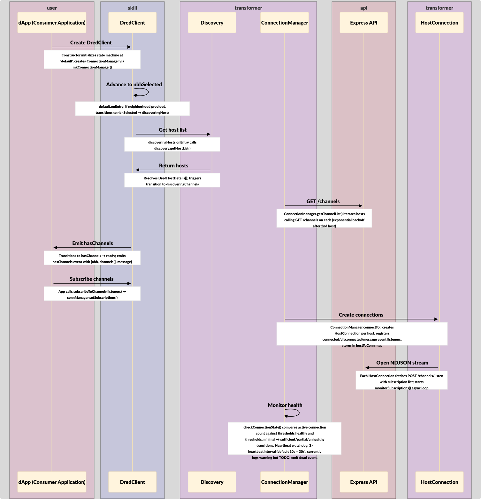
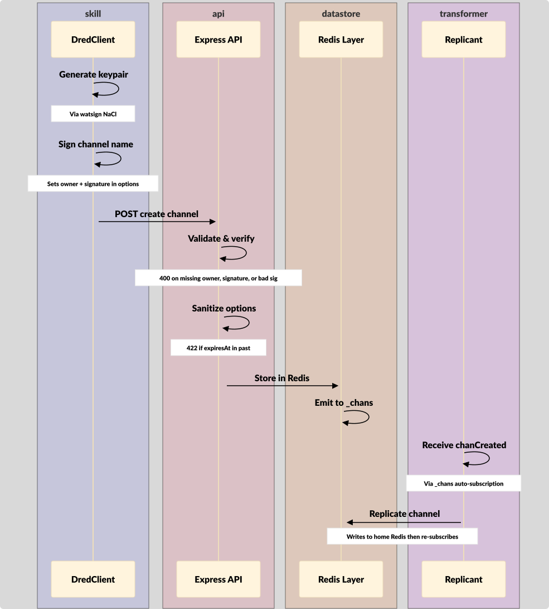
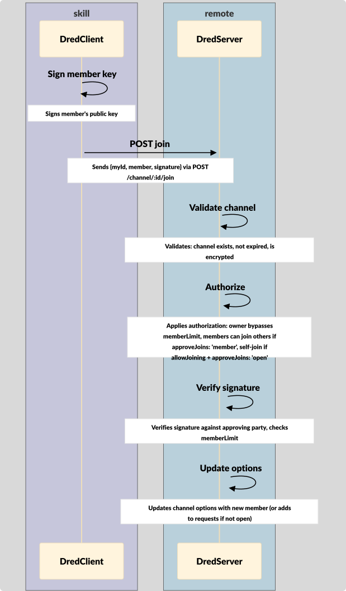
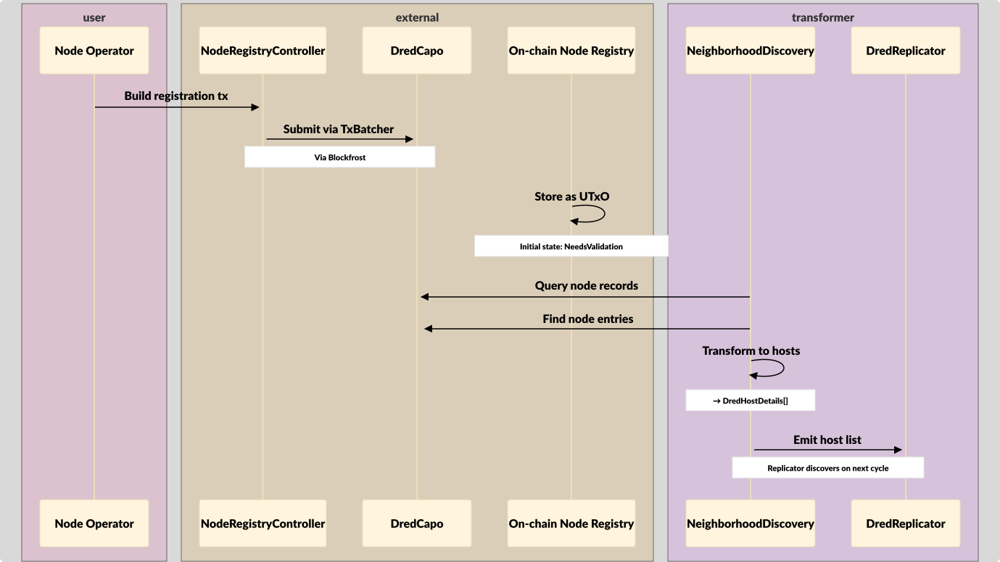

# DRED - Architecture

> **🏗️ ARCHITECTURE TRIGGER: READ THIS FIRST**
>
> This architecture document is strictly managed. Before interpreting, implementing, or discussing architectural decisions, you **MUST** read and apply the **Architecture Consumer Skill** at:
>
> `architect/architect-consumer.SKILL.md`
>
> **CRITICAL**: You are **FORBIDDEN** from modifying this file or making architectural changes until you have ingested the "Read-Only" constraints and "Escalation Protocol" defined in that skill.
> NOTE: If you've already studied the full Architect skill (`architect/architect.SKILL.md`), you don't need the consumer skill.

**Maturity**:

- draft: 77/77

## Components and Concerns

- [ConnectionManager](#connectionmanager-arch-e1189hsjm9) (internal): State machine managing connections to multiple hosts with health thresholds (minimal/healthy/degraded/disconnected)
- [Discovery](#discovery-arch-56nvf2nfc3) (local): Pluggable host discovery — bridges on-chain registry to runtime
- [Docs Site](#docs-site-arch-ev6tt1ct8q) (external): Next.js static documentation site on GitHub Pages
- [DRED](#dred-arch-ar4skk7d55) (remote): Decentralized Redis State Channels — a distributed real-time messaging system for Cardano dApps, providing shared communication channels served by a decentralized network of nodes.
- [DredCapo](#dredcapo-arch-jvh91qt0tq) (internal): Central on-chain coordinator extending StellarTokenomicsCapo — orchestrates controllers and tokenomics
- [DredClient](#dredclient-arch-yjznx2s7w1) (local): State-machine client library for dApps — discovery, connection management, channel ops, crypto, events
- [DredReplicator](#dredreplicator-arch-19cm38bgqx) (internal): Replication orchestrator — discovers peers, spawns one Replicant per peer, collects readiness
- [DredServer](#dredserver-arch-ahm6njveq4) (remote): Node process — Express HTTP + Redis Streams message relay, channel management, deduplication, replication
- [Express API](#express-api-arch-jzxbmbm3ak) (internal): HTTP request handler — Express 4.17 routes for channel CRUD, message posting, and NDJSON streaming
- [HostConnection](#hostconnection-arch-svn7yd8jpe) (internal): Single persistent NDJSON stream connection to one DredServer — handles connect/disconnect/reconnect and heartbeat watchdog
- [NeighborhoodController](#neighborhoodcontroller-arch-n72kyvtxed) (internal): Neighborhood registration — builds transactions for creating application-specific node groupings
- [NeighborhoodDiscovery](#neighborhooddiscovery-arch-tbw469ej0t) (internal): Production Discovery implementation — queries Blockfrost HTTP API to read NodeRegistrationData and NeighborhoodData UTxOs from Cardano L1
- [NodeRegistryController](#noderegistrycontroller-arch-1p3vb542wn) (internal): Node registration CRUD — builds transactions for registering/updating DRED nodes on Cardano L1
- [On-chain Node Registry](#on-chain-node-registry-arch-6hkc6h0c0s) (external): Smart contracts for node/neighborhood registration and protocol settings on Cardano L1
- [ProtocolSettingsController](#protocolsettingscontroller-arch-2cfdgt2dk5) (internal): Protocol parameter governance — manages heartbeat intervals, uptime requirements, registration fees, operator stake
- [Redis Layer](#redis-layer-arch-wr1and2aqv) (internal): Redis data access — forked @hearit-io/redis-channels for Streams produce/consume/subscribe, plus RedisHash, RedisSet, RedisCuckooSet helpers
- [Replicant](#replicant-arch-gvx8j2dp6j) (internal): Per-peer replication agent — wraps a DredClient to subscribe to peer channels and feed messages into home server dedup pipeline
- [StaticHostDiscovery](#statichostdiscovery-arch-tkftyxhajf) (internal): Config-driven Discovery implementation for development and testing — reads host list from static configuration

### Concerns

| Concern | Type | Owner | Contributors | Depends On |
|---------|------|-------|-------------|------------|
| Message channels | resource | [DredServer](#dredserver-arch-ahm6njveq4) | - | [DredClient](#dredclient-arch-yjznx2s7w1) |
| Message deduplication | resource | [DredServer](#dredserver-arch-ahm6njveq4) | - | - |
| NDJSON message stream | resource | [DredServer](#dredserver-arch-ahm6njveq4) | - | [DredClient](#dredclient-arch-yjznx2s7w1) |
| Bookmark storage | artifact | [DredClient](#dredclient-arch-yjznx2s7w1) | - | [DredServer](#dredserver-arch-ahm6njveq4) |
| Host list | artifact | [Discovery](#discovery-arch-56nvf2nfc3) | - | [DredServer](#dredserver-arch-ahm6njveq4), [DredClient](#dredclient-arch-yjznx2s7w1) |
| Neighborhood membership | artifact | [On-chain Node Registry](#on-chain-node-registry-arch-6hkc6h0c0s) | - | [Discovery](#discovery-arch-56nvf2nfc3) |
| Node registration data | artifact | [On-chain Node Registry](#on-chain-node-registry-arch-6hkc6h0c0s) | - | [Discovery](#discovery-arch-56nvf2nfc3) |
| Protocol settings | artifact | [On-chain Node Registry](#on-chain-node-registry-arch-6hkc6h0c0s) | - | [DredServer](#dredserver-arch-ahm6njveq4) |
| NaCl key pairs & signatures | artifact | [DredClient](#dredclient-arch-yjznx2s7w1) | - | [DredServer](#dredserver-arch-ahm6njveq4) |
| Redis Streams | resource | [DredServer](#dredserver-arch-ahm6njveq4) | - | - |
| Channel options/metadata | artifact | [DredServer](#dredserver-arch-ahm6njveq4) | - | [DredClient](#dredclient-arch-yjznx2s7w1) |
| Connection health | resource | [DredClient](#dredclient-arch-yjznx2s7w1) | - | - |
| Replication metadata | artifact | [DredServer](#dredserver-arch-ahm6njveq4) | - | - |
| Heartbeat signals | artifact | [DredServer](#dredserver-arch-ahm6njveq4) | - | [DredClient](#dredclient-arch-yjznx2s7w1) |

## Components

### Component: ConnectionManager (internal; draft - ARCH-e1189hsjm9)

State machine managing connections to multiple hosts with health thresholds (minimal/healthy/degraded/disconnected)

**Activities**:

- Open and manage HostConnection instances (one per host)
- Monitor connection health via threshold comparison
- Route incoming messages to ChannelSubscriptionListener by channel

**Concerns and Responsibilities**:
- **Responsibility**: Maintain aggregate health state across all host connections
- **Responsibility**: Transition between connecting/healthy/degraded/disconnected based on configured thresholds
- **Responsibility**: Call notifySubscribers() to route messages from HostConnections to channel listeners

**Data Flows**: [Message Posting & Delivery](#dataflow-ARCH-3nbmnx6tpt), [Client Connection & Discovery](#dataflow-ARCH-9nsyshbc0s)

---

### Component: Discovery (local; draft - ARCH-56nvf2nfc3)

Pluggable host discovery — bridges on-chain registry to runtime

**Activities**:

- Provide getHostList(), getNeighborhoods(), getConnectionThresholds()
- Emit hosts:updated events when host list changes
- Bridge on-chain registry data to runtime host lists

**Concerns and Responsibilities**:
- Owns: **Host list** - Resolved list of available DRED nodes in a neighborhood
- Depends on: **Neighborhood membership** - Filters hosts by application neighborhood (NeighborhoodDiscovery)
- Depends on: **Node registration data** - Reads from on-chain registry (NeighborhoodDiscovery via Blockfrost)
- **Responsibility**: Resolve and maintain current host list from configured source
- **Responsibility**: Notify consumers when host availability changes
- **Responsibility**: Support both StaticHostDiscovery (dev/testing) and NeighborhoodDiscovery (production via Blockfrost)

**Interfaces**: [On-chain Registry Query](#interface-ARCH-5s8s78gtrk), [Discovery API](#interface-ARCH-g669z8jjpv), [Host Discovery Events](#interface-ARCH-b42zj3kmp6), [System Topology](#interface-ARCH-7njdc3bc9x)

**Data Flows**: [Replication](#dataflow-ARCH-zmmn6tsrb3), [Client Connection & Discovery](#dataflow-ARCH-9nsyshbc0s), [Node Registration (On-chain)](#dataflow-ARCH-h5s5e84788)

---

### Component: Docs Site (external; draft - ARCH-ev6tt1ct8q)

Next.js static documentation site on GitHub Pages

**Activities**:

- Present conceptual documentation and architecture guides
- Publish blog posts
- Build from Markdoc/MDX source to static HTML via Next.js

**Concerns and Responsibilities**:
- **Responsibility**: Maintain up-to-date documentation for all DRED components and APIs

---

### Component: DRED (remote; draft - ARCH-ar4skk7d55)

Decentralized Redis State Channels — a distributed real-time messaging system for Cardano dApps, providing shared communication channels served by a decentralized network of nodes.

**Activities**:

- Relay real-time messages between clients through decentralized node network
- Manage encrypted communication channels with NaCl crypto
- Replicate state across peer nodes for availability and partition tolerance

**Concerns and Responsibilities**:
- **Responsibility**: Guarantee message delivery to all connected subscribers via NDJSON streaming
- **Responsibility**: Prevent duplicate message processing across direct posts and replication
- **Responsibility**: Maintain decentralized node membership through on-chain registry
- **Responsibility**: Provide pluggable discovery so clients find nodes without central authority
- **Responsibility**: Enforce channel ownership and membership authorization via cryptographic signatures

---

### Component: DredCapo (internal; draft - ARCH-jvh91qt0tq)

Central on-chain coordinator extending StellarTokenomicsCapo — orchestrates controllers and tokenomics

**Activities**:

- Coordinate node registry, neighborhood, and protocol settings controllers
- Extend StellarTokenomicsCapo for tokenomics integration

**Concerns and Responsibilities**:
- **Responsibility**: Serve as the single entry point for all on-chain DRED operations

---

### Component: DredClient (local; draft - ARCH-yjznx2s7w1)

State-machine client library for dApps — discovery, connection management, channel ops, crypto, events

**Activities**:

- Progress through state machine (default → discoveringHosts → discoveringChannels → ready)
- Manage multi-host connections with health monitoring via ConnectionManager
- Provide channel operations (create, join, post, subscribe) with NaCl signing

**Concerns and Responsibilities**:
- Owns: **Bookmark storage** - Pluggable BookmarkStorage interface for client resumability — NoBookmarkMemory (no-op) or app implementation
- Owns: **NaCl key pairs & signatures** - TweetNaCl signing key pairs — generated by client for channel creation and membership authorization
- Owns: **Connection health** - ConnectionManager state machine managing connections to multiple hosts with health thresholds (minimal/healthy/degraded/disconnected)
- Depends on: **Message channels** - Reads/writes channels via DredServer HTTP API
- Depends on: **NDJSON message stream** - HostConnection parses NDJSON stream, ConnectionManager routes to subscribers
- Depends on: **Host list** - Consumes Discovery to find servers for connection
- Depends on: **Channel options/metadata** - Reads channel options via GET /channels and channel events
- Depends on: **Heartbeat signals** - HostConnection monitors heartbeats, watchdog triggers reconnect after 3× missed intervals
- **Responsibility**: Maintain connection health state (healthy/degraded/disconnected) across multiple hosts
- **Responsibility**: Generate NaCl key pairs and sign channel names and member IDs
- **Responsibility**: Deduplicate incoming messages client-side via rotating Set pairs (30s rotation)
- **Responsibility**: Emit typed events for application integration (hasChannels, channel:message, state:changed, error)
- **Responsibility**: Abstract Discovery interface so apps work identically with static or on-chain discovery

**Interfaces**: [Client-Server Communication](#interface-ARCH-a5x82d6cpa), [Discovery API](#interface-ARCH-g669z8jjpv), [Host Discovery Events](#interface-ARCH-b42zj3kmp6), [Host Connection Events](#interface-ARCH-h6d8mpeb9m), [Connection Manager Events](#interface-ARCH-qpvwnp8ypx), [Client Application Events](#interface-ARCH-y31jrfgawt), [Replicant Channel Discovery](#interface-ARCH-1ardm81zb5), [System Topology](#interface-ARCH-7njdc3bc9x)

**Data Flows**: [Message Posting & Delivery](#dataflow-ARCH-3nbmnx6tpt), [Client Connection & Discovery](#dataflow-ARCH-9nsyshbc0s), [Channel Creation (Encrypted)](#dataflow-ARCH-8xy57xjz2r), [Channel Join (Encrypted)](#dataflow-ARCH-78hxmr8h6k)

---

### Component: DredReplicator (internal; draft - ARCH-19cm38bgqx)

Replication orchestrator — discovers peers, spawns one Replicant per peer, collects readiness

**Activities**:

- Discover peer servers via Discovery on boot
- Spawn and manage Replicant instances (one per peer)
- Collect replicantsReady promises for startup coordination

**Concerns and Responsibilities**:
- **Responsibility**: Ensure all reachable peers have active Replicant connections
- **Responsibility**: Restart replication when peer topology changes

**Data Flows**: [Replication](#dataflow-ARCH-zmmn6tsrb3)

---

### Component: DredServer (remote; draft - ARCH-ahm6njveq4)

Node process — Express HTTP + Redis Streams message relay, channel management, deduplication, replication

**Activities**:

- Relay messages between clients via HTTP POST ingestion and NDJSON streaming
- Manage channel lifecycle (create, join, list, expire) with crypto validation
- Coordinate replication to/from peer servers via internal DredReplicator

**Concerns and Responsibilities**:
- Owns: **Message channels** - Redis Streams channels — creates, stores, and serves channel data
- Owns: **Message deduplication** - Redis-backed known-messages set — prevents replication loops and duplicate posts via composite key channel/ocid
- Owns: **NDJSON message stream** - Chunked HTTP NDJSON streaming for server→client message delivery
- Owns: **Redis Streams** - Sole component with direct Redis access — Streams (messages), Hash (channels, options, bookmarks), Set (dedup: knownMessages), CuckooFilter
- Owns: **Channel options/metadata** - Per-channel configuration stored in Redis Hash — encryption flag, owner, members, memberLimit, approveJoins, allowJoining, expiration
- Owns: **Replication metadata** - Per-message replication fields: replFrom, replAt, origMsgId, origSrvId — used for loop prevention and dedup
- Owns: **Heartbeat signals** - Periodic heartbeat messages sent to connected clients for liveness detection — HostConnection watchdog triggers after 3× missed intervals
- Depends on: **Bookmark storage** - DredReplicator uses Redis hash per source pair for server-side replication bookmarks
- Depends on: **Host list** - Uses Discovery to find peer servers for replication
- Depends on: **Protocol settings** - Governs operational parameters for server behavior
- Depends on: **NaCl key pairs & signatures** - Verifies signatures via verifySig() for channel creation and join authorization
- **Responsibility**: Guarantee message deduplication via ensureMessageProcessedOnce() with Redis-backed known-messages set
- **Responsibility**: Validate channel ownership signatures before accepting channel creation
- **Responsibility**: Enforce channel membership authorization rules (owner/member/self-join)
- **Responsibility**: Stream heartbeats to connected clients for liveness detection
- **Responsibility**: Publish all accepted messages to Redis Streams for subscriber delivery
- **Responsibility**: Expose admin endpoints for replication status monitoring

**Interfaces**: [Client-Server Communication](#interface-ARCH-a5x82d6cpa), [Server-to-Server Replication](#interface-ARCH-brvwt30z8f), [Replicant Channel Discovery](#interface-ARCH-1ardm81zb5), [Replicant Readiness Signal](#interface-ARCH-x3mwe20j93), [System Topology](#interface-ARCH-7njdc3bc9x)

**Data Flows**: [Node Registration (On-chain)](#dataflow-ARCH-h5s5e84788)

---

### Component: Express API (internal; draft - ARCH-jzxbmbm3ak)

HTTP request handler — Express 4.17 routes for channel CRUD, message posting, and NDJSON streaming

**Activities**:

- Route HTTP requests to channel/message handlers
- Stream NDJSON responses for /channels/listen subscriptions

**Concerns and Responsibilities**:
- **Responsibility**: Expose POST /channel/:id (create), POST /channel/:id/join, POST /channel/:id/message, GET /channels, POST /channels/listen
- **Responsibility**: Validate request payloads and return JSON error responses
- **Responsibility**: Manage chunked HTTP connections for NDJSON streaming

**Data Flows**: [Message Posting & Delivery](#dataflow-ARCH-3nbmnx6tpt), [Client Connection & Discovery](#dataflow-ARCH-9nsyshbc0s), [Channel Creation (Encrypted)](#dataflow-ARCH-8xy57xjz2r), [Channel Join (Encrypted)](#dataflow-ARCH-78hxmr8h6k)

---

### Component: HostConnection (internal; draft - ARCH-svn7yd8jpe)

Single persistent NDJSON stream connection to one DredServer — handles connect/disconnect/reconnect and heartbeat watchdog

**Activities**:

- Maintain persistent NDJSON HTTP stream to a DredServer
- Parse incoming NDJSON lines and emit typed events

**Concerns and Responsibilities**:
- **Responsibility**: Emit connected/disconnected/replacedBy/failed/message events to ConnectionManager
- **Responsibility**: Monitor heartbeats — watchdog triggers after 3× missed intervals
- **Responsibility**: Reconnect with configurable delay on disconnection

**Data Flows**: [Message Posting & Delivery](#dataflow-ARCH-3nbmnx6tpt), [Client Connection & Discovery](#dataflow-ARCH-9nsyshbc0s)

---

### Component: NeighborhoodController (internal; draft - ARCH-n72kyvtxed)

Neighborhood registration — builds transactions for creating application-specific node groupings

**Activities**:

- Build transactions for neighborhood registration

**Concerns and Responsibilities**:
- **Responsibility**: Validate neighborhood data before transaction construction

---

### Component: NeighborhoodDiscovery (internal; draft - ARCH-tbw469ej0t)

Production Discovery implementation — queries Blockfrost HTTP API to read NodeRegistrationData and NeighborhoodData UTxOs from Cardano L1

**Activities**:

- Query Blockfrost for node registration UTxOs
- Filter and resolve hosts by neighborhood membership

**Concerns and Responsibilities**:
- **Responsibility**: Translate on-chain UTxO data into DredHostDetails for runtime consumption
- **Responsibility**: Emit hosts:updated events when on-chain state changes

---

### Component: NodeRegistryController (internal; draft - ARCH-1p3vb542wn)

Node registration CRUD — builds transactions for registering/updating DRED nodes on Cardano L1

**Activities**:

- Build transactions for node registration and updates via mkTxnRegisteringNode()

**Concerns and Responsibilities**:
- **Responsibility**: Validate node registration data (nodeAddress, nodePort, nodePublicKey) before transaction construction

---

### Component: On-chain Node Registry (external; draft - ARCH-6hkc6h0c0s)

Smart contracts for node/neighborhood registration and protocol settings on Cardano L1

**Activities**:

- Register and update DRED node entries (address, port, public key, heartbeat, stake)
- Register application-specific neighborhoods (groupings of nodes)
- Govern protocol parameters (heartbeat intervals, uptime requirements, registration fees, operator stake)

**Concerns and Responsibilities**:
- Owns: **Neighborhood membership** - Which nodes serve which applications — stored as on-chain UTxOs
- Owns: **Node registration data** - Authoritative source of registered nodes on Cardano L1 — address, port, public key, heartbeat, stake
- Owns: **Protocol settings** - Network-wide operational parameters — heartbeat intervals, uptime requirements, registration fees, operator stake
- **Responsibility**: Maintain authoritative source of registered nodes on Cardano L1
- **Responsibility**: Enforce registration validation via Helios on-chain validators
- **Responsibility**: Store network-wide operational parameters accessible to all nodes

**Interfaces**: [On-chain Registry Query](#interface-ARCH-5s8s78gtrk), [System Topology](#interface-ARCH-7njdc3bc9x)

**Data Flows**: [Node Registration (On-chain)](#dataflow-ARCH-h5s5e84788)

---

### Component: ProtocolSettingsController (internal; draft - ARCH-2cfdgt2dk5)

Protocol parameter governance — manages heartbeat intervals, uptime requirements, registration fees, operator stake

**Activities**:

- Build transactions for protocol parameter updates

**Concerns and Responsibilities**:
- **Responsibility**: Validate protocol parameter changes before transaction construction

---

### Component: Redis Layer (internal; draft - ARCH-wr1and2aqv)

Redis data access — forked @hearit-io/redis-channels for Streams produce/consume/subscribe, plus RedisHash, RedisSet, RedisCuckooSet helpers

**Activities**:

- Produce/consume/subscribe on Redis Streams for message channels
- Provide Hash, Set, and CuckooFilter access for channels, options, dedup, bookmarks

**Concerns and Responsibilities**:
- **Responsibility**: Sole component with direct Redis (ioredis) access
- **Responsibility**: Maintain connection to Redis over TCP

**Data Flows**: [Message Posting & Delivery](#dataflow-ARCH-3nbmnx6tpt), [Replication](#dataflow-ARCH-zmmn6tsrb3), [Channel Creation (Encrypted)](#dataflow-ARCH-8xy57xjz2r), [Channel Join (Encrypted)](#dataflow-ARCH-78hxmr8h6k)

---

### Component: Replicant (internal; draft - ARCH-gvx8j2dp6j)

Per-peer replication agent — wraps a DredClient to subscribe to peer channels and feed messages into home server dedup pipeline

**Activities**:

- Create DredClient pointed at peer, generate keys, find common channels
- Subscribe to common channels via mass listener + _chans meta-channel
- Apply loop prevention and feed messages into home server's ensureMessageProcessedOnce()

**Concerns and Responsibilities**:
- **Responsibility**: Prevent replication loops by checking origSrvId and replFrom
- **Responsibility**: Attach replication metadata (replFrom, replAt, origMsgId, origSrvId) to replicated messages
- **Responsibility**: Store and resume from bookmarks in Redis hash per source pair

**Data Flows**: [Replication](#dataflow-ARCH-zmmn6tsrb3), [Channel Creation (Encrypted)](#dataflow-ARCH-8xy57xjz2r)

---

### Component: StaticHostDiscovery (internal; draft - ARCH-tkftyxhajf)

Config-driven Discovery implementation for development and testing — reads host list from static configuration

**Activities**:

- Return preconfigured host list without network calls

**Concerns and Responsibilities**:
- **Responsibility**: Provide stable, predictable host list for dev/test environments

---

### Nested Components

> These components declare a `parentComponent` and should each have a separate architectural breakdown document. The summary here is a placeholder until that breakdown exists.

| Component | Parent | Summary |
|-----------|--------|---------|
| [ConnectionManager](#connectionmanager-arch-e1189hsjm9) | [DredClient](#dredclient-arch-yjznx2s7w1) | State machine managing connections to multiple hosts with health thresholds (minimal/healthy/degraded/disconnected) |
| [DredCapo](#dredcapo-arch-jvh91qt0tq) | [On-chain Node Registry](#on-chain-node-registry-arch-6hkc6h0c0s) | Central on-chain coordinator extending StellarTokenomicsCapo — orchestrates controllers and tokenomics |
| [DredReplicator](#dredreplicator-arch-19cm38bgqx) | [DredServer](#dredserver-arch-ahm6njveq4) | Replication orchestrator — discovers peers, spawns one Replicant per peer, collects readiness |
| [Express API](#express-api-arch-jzxbmbm3ak) | [DredServer](#dredserver-arch-ahm6njveq4) | HTTP request handler — Express 4.17 routes for channel CRUD, message posting, and NDJSON streaming |
| [HostConnection](#hostconnection-arch-svn7yd8jpe) | [DredClient](#dredclient-arch-yjznx2s7w1) | Single persistent NDJSON stream connection to one DredServer — handles connect/disconnect/reconnect and heartbeat watchdog |
| [NeighborhoodController](#neighborhoodcontroller-arch-n72kyvtxed) | [On-chain Node Registry](#on-chain-node-registry-arch-6hkc6h0c0s) | Neighborhood registration — builds transactions for creating application-specific node groupings |
| [NeighborhoodDiscovery](#neighborhooddiscovery-arch-tbw469ej0t) | [Discovery](#discovery-arch-56nvf2nfc3) | Production Discovery implementation — queries Blockfrost HTTP API to read NodeRegistrationData and NeighborhoodData UTxOs from Cardano L1 |
| [NodeRegistryController](#noderegistrycontroller-arch-1p3vb542wn) | [On-chain Node Registry](#on-chain-node-registry-arch-6hkc6h0c0s) | Node registration CRUD — builds transactions for registering/updating DRED nodes on Cardano L1 |
| [ProtocolSettingsController](#protocolsettingscontroller-arch-2cfdgt2dk5) | [On-chain Node Registry](#on-chain-node-registry-arch-6hkc6h0c0s) | Protocol parameter governance — manages heartbeat intervals, uptime requirements, registration fees, operator stake |
| [Redis Layer](#redis-layer-arch-wr1and2aqv) | [DredServer](#dredserver-arch-ahm6njveq4) | Redis data access — forked @hearit-io/redis-channels for Streams produce/consume/subscribe, plus RedisHash, RedisSet, RedisCuckooSet helpers |
| [Replicant](#replicant-arch-gvx8j2dp6j) | [DredServer](#dredserver-arch-ahm6njveq4) | Per-peer replication agent — wraps a DredClient to subscribe to peer channels and feed messages into home server dedup pipeline |
| [StaticHostDiscovery](#statichostdiscovery-arch-tkftyxhajf) | [Discovery](#discovery-arch-56nvf2nfc3) | Config-driven Discovery implementation for development and testing — reads host list from static configuration |

### External Dependencies

| Dependency | Type | Used By | Interaction |
|-----------|------|---------|-------------|
| Redis | External service | DredServer | ioredis over TCP — Streams, Hash, Set, CuckooFilter |
| Cardano L1 (Blockfrost) | External service | NeighborhoodDiscovery | HTTP API — reads node/neighborhood UTxOs |
| stellar-contracts | Library | On-chain Node Registry | Transaction building framework |
| stellar-tokenomics | Library | On-chain Node Registry | Tokenomics layer (DredCapo extends StellarTokenomicsCapo) |
| @poshplum/utils | Library | DredServer, DredClient | StateMachine, zonedLogger, autobind, asyncDelay |
| eventemitter3 | Library | All off-chain | Typed event emission |
| TweetNaCl | Library | DredClient, DredServer | Key gen, signing, verification (via StringNacl wrapper) |
| Express 4.17 | Library | DredServer | HTTP framework |
| cross-fetch | Library | DredClient | Isomorphic HTTP fetch |

## Actors

External participants who interact with the system:

| ARCH-UUT | Name | Description |
|----------|------|-------------|
| ARCH-ne9hs8j281 | dApp (Consumer Application) | External application consuming DredClient library — browser or Node.js |
| ARCH-6vspekwt20 | Node Operator | Human or automated process that registers and maintains DRED nodes on Cardano L1 |
| ARCH-hrztf927yb | Peer Server | Another DredServer instance in the same neighborhood — target of replication |

## Interfaces

### Interface: Client-Server Communication (library_call; draft - ARCH-a5x82d6cpa)

[DredClient](#dredclient-arch-yjznx2s7w1), [DredServer](#dredserver-arch-ahm6njveq4)

DredClient initiates all requests. HTTP REST (POST for mutations, GET for queries) + NDJSON chunked streaming (POST /channels/listen for subscriptions). Endpoints: POST /channel/:id (create), POST /channel/:id/join, POST /channel/:id/message, GET /channels, POST /channels/listen (NDJSON stream with messages + heartbeats).

**Payload**: POST /channel/:id — create channel (body: ChannelOptions); POST /channel/:id/join — join channel (body: myId, member, signature); POST /channel/:id/message — post message (body: type, msg, ocid); GET /channels — list channels; POST /channels/listen — subscribe (body: SubscriptionList; response: NDJSON stream)

**Error**: JSON error responses with error field; connection drops trigger ConnectionManager health state transitions

---

### Interface: Server-to-Server Replication (library_call; draft - ARCH-brvwt30z8f)

[DredServer](#dredserver-arch-ahm6njveq4), [DredServer](#dredserver-arch-ahm6njveq4)

Replicant (home server) initiates connection to target server. Each server's DredReplicator spawns Replicant instances that use DredClient to connect to peer servers — reuses the same Client → Server HTTP REST + NDJSON interface. Messages carry replication metadata (replFrom, replAt, origMsgId, origSrvId). Dedup via ensureMessageProcessedOnce() prevents loops.

**Payload**: Same as Client → Server, plus replication metadata (replFrom, replAt, origMsgId, origSrvId)

**Error**: Connection failures trigger retry with configurable interval (default 60s, 6s in test)

---

### Interface: On-chain Registry Query (library_call; draft - ARCH-5s8s78gtrk)

[Discovery](#discovery-arch-56nvf2nfc3), [On-chain Node Registry](#on-chain-node-registry-arch-6hkc6h0c0s)

NeighborhoodDiscovery initiates. Cardano chain indexer query via stellar-contracts framework reads NodeRegistrationData and NeighborhoodData UTxOs from on-chain registry.

**Payload**: NodeRegistrationData and NeighborhoodData UTxOs

**Error**: Chain query failures; fallback behavior TBD

---

### Interface: Discovery API (internal_call; draft - ARCH-g669z8jjpv)

[DredClient](#dredclient-arch-yjznx2s7w1), [Discovery](#discovery-arch-56nvf2nfc3)

Consumer (DredClient or DredServer) initiates. Internal TypeScript interface call: getHostList() → DredHostDetails[], getNeighborhoods() → string[], getConnectionThresholds() → ConnectionThresholds. Throws if discovery not configured or neighborhood not set.

**Payload**: getHostList() → DredHostDetails[]; getNeighborhoods() → string[]; getConnectionThresholds() → ConnectionThresholds

**Error**: Throws if discovery not configured or neighborhood not set

---

### Interface: Host Discovery Events (event; draft - ARCH-b42zj3kmp6)

[Discovery](#discovery-arch-56nvf2nfc3), [DredClient](#dredclient-arch-yjznx2s7w1)

Discovery emits via EventEmitter (DiscoveryEvents). hosts:updated → {hosts: DredHostDetails[], message, nbh} triggers ConnectionManager.setHostList() and reconnection. hosts:ready → same payload, unblocks setSubscriptions() during initial setup.

**Payload**: hosts:updated → {hosts: DredHostDetails[], message, nbh}; hosts:ready → same payload, unblocks initial setup

---

### Interface: Host Connection Events (event; draft - ARCH-h6d8mpeb9m)

[DredClient](#dredclient-arch-yjznx2s7w1), [DredClient](#dredclient-arch-yjznx2s7w1)

HostConnection emits via EventEmitter (HostConnectionEventTypes). connected → {connection, delayTime, attempts}, disconnected → {connection, reason, message}, replacedBy → {connection, replacement}, failed → {connection, reason, message}, message → {connection, mid, ocid, channel, type, msg, nbh, ts, details, neighborhood} routed to ChannelSubscriptionListener.

**Payload**: connected → {connection, delayTime, attempts}; disconnected → {connection, reason, message}; replacedBy → {connection, replacement}; failed → {connection, reason, message}; message → {connection, mid, ocid, channel, type, msg, nbh, ts, details, neighborhood}

---

### Interface: Connection Manager Events (event; draft - ARCH-qpvwnp8ypx)

[DredClient](#dredclient-arch-yjznx2s7w1), [DredClient](#dredclient-arch-yjznx2s7w1)

ConnectionManager emits via EventEmitter (ManagerEvents). connected → {message} (healthy state), connect:minimal → {message, altMessageRealtime, altMessageSecurity} (partial connectivity), disconnected → {message, recommendation, altMessageRealtime, altMessageSecurity}, channel:added → {nbh, channel, message}.

**Payload**: connected → {message} (sufficient connections, healthy state); connect:minimal → {message, altMessageRealtime, altMessageSecurity} (partial connectivity); disconnected → {message, recommendation, altMessageRealtime, altMessageSecurity}; channel:added → {nbh, channel, message} (new channel discovered from host)

---

### Interface: Client Application Events (event; draft - ARCH-y31jrfgawt)

[DredClient](#dredclient-arch-yjznx2s7w1), [dApp (Consumer Application)](#actors)

DredClient emits via EventEmitter (ClientEvents). needsNeighborhood → {message, nbhs[]}, hasChannels → {nbh, channels[], message}, channel:created → {nbh, channel, options}, state:changed → {nbh, status, channels[], message}, error → {reason, message, recommendation}.

**Payload**: needsNeighborhood → {message, nbhs[]} (app must call setNeighborhood()); hasChannels → {nbh, channels[], message} (channel list ready for UI); channel:created → {nbh, channel, options} (new channel detected via _chans); state:changed → {nbh, status, channels[], message} (state machine transition); error → {reason, message, recommendation} (request or protocol failure)

---

### Interface: Replicant Channel Discovery (event; draft - ARCH-1ardm81zb5)

[DredClient](#dredclient-arch-yjznx2s7w1), [DredServer](#dredserver-arch-ahm6njveq4)

repClient (DredClient used by Replicant) emits via EventEmitter (ClientEvents). channel:created → {nbh, channel, options} triggers Replicant.channelWasAdded(), which creates channel on home server and re-subscribes to updated common channels.

**Payload**: channel:created → {nbh, channel, options} triggers Replicant.channelWasAdded()

---

### Interface: Replicant Readiness Signal (event; draft - ARCH-x3mwe20j93)

[DredServer](#dredserver-arch-ahm6njveq4), [DredServer](#dredserver-arch-ahm6njveq4)

Replicant emits via EventEmitter (ReplicationEvents). replicator:connected → Replicant instance. DredReplicator collects replicantsReady promise from all replicants.

**Payload**: replicator:connected → Replicant instance (readiness signal to coordinator)

---

### Interface: System Topology (library_call; draft - ARCH-7njdc3bc9x)

[DredServer](#dredserver-arch-ahm6njveq4), [DredClient](#dredclient-arch-yjznx2s7w1), [On-chain Node Registry](#on-chain-node-registry-arch-6hkc6h0c0s), [Discovery](#discovery-arch-56nvf2nfc3), [dApp (Consumer Application)](#actors), [Node Operator](#actors), [Peer Server](#actors)

Overall DRED component topology showing how clients, servers, discovery, on-chain registry, and external consumers connect.

---

## Data Flow

### Message Posting & Delivery (draft - ARCH-3nbmnx6tpt)

Full lifecycle of a message from client POST through Redis Stream to all listening clients. Data shape transitions: {type, msg, ocid} → HTTP JSON body → Redis Stream entry (XADD) → NDJSON line {mid, channel, type, nbh, msg, ocid} �� FullDredMessage with {connection, ts, neighborhood, details}. The posting client gets a synchronous confirmation; delivery to subscribers is async via the Redis Stream consumer loop (XREAD).
**Trigger**: DredClient posts message via POST /channel/:id/message with {type, msg, ocid}

1. **[DredClient](#dredclient-arch-yjznx2s7w1)** → **[Express API](#express-api-arch-jzxbmbm3ak)**: POST message — POST /channel/:id/message with {type, msg, ocid}
2. **[Express API](#express-api-arch-jzxbmbm3ak)** → **[Express API](#express-api-arch-jzxbmbm3ak)**: Validate request — postMessageInChannel() checks for msg, ocid, type fields; strips reserved _type/_data keys
3. **[Express API](#express-api-arch-jzxbmbm3ak)** → **[Redis Layer](#redis-layer-arch-wr1and2aqv)**: Dedup & publish — ensureMessageProcessedOnce(channel, ocid, msg) checks Redis Set via composite key channel/ocid; if new, publishMessageToChannel() calls channelConn.produce() → Redis XADD to stream
4. **[Express API](#express-api-arch-jzxbmbm3ak)** → **[DredClient](#dredclient-arch-yjznx2s7w1)**: Return confirmation — Returns {id, status: "created", ocid} to posting client
5. **[Redis Layer](#redis-layer-arch-wr1and2aqv)** → **[Express API](#express-api-arch-jzxbmbm3ak)**: Consumer reads Stream — monitorChannelChanges() async loop: channelConn.consume() calls Redis XREAD, yields message batches
6. **[Express API](#express-api-arch-jzxbmbm3ak)** → **[HostConnection](#hostconnection-arch-svn7yd8jpe)**: Write NDJSON line — Writes NDJSON line {mid, channel, type, nbh, msg, ocid, ...meta} + newline to each HostConnection with active /channels/listen response
7. **[HostConnection](#hostconnection-arch-svn7yd8jpe)** → **[ConnectionManager](#connectionmanager-arch-e1189hsjm9)**: Emit message event — HostConnection's monitorSubscriptions() parses NDJSON via betterJsonStream, emits typed message event
8. **[ConnectionManager](#connectionmanager-arch-e1189hsjm9)** → **[ConnectionManager](#connectionmanager-arch-e1189hsjm9)**: Route to subscriber — notifySubscribers() routes to ChannelSubscriptionListener by channel (or mass handler); filters out genesis events
9. **[ConnectionManager](#connectionmanager-arch-e1189hsjm9)** → **[dApp (Consumer Application)](#actors)**: Invoke callback — Subscriber's notify() invokes app callback with FullDredMessage {connection, ts, neighborhood, details}

### Replication (draft - ARCH-zmmn6tsrb3)

Server-to-server message replication via internal DredClient instances. DredReplicator discovers peers (filtering out own serverId), spawns one Replicant per peer. Each Replicant creates a DredClient with StaticHostDiscovery focused on the target, subscribes via mass listener. DredClient auto-subscribes to _chans meta-channel. Messages flow through loop prevention (origSrvId + replFrom checks) and dedup before publishing to home Redis Streams. Bookmarks in Redis hash per source pair (key: bookmarks:repl<localId>-at-<remoteId>-#) enable resumability.
**Trigger**: DredServer.listen() calls startReplicating() when args.replicate is true (default)

1. **[DredReplicator](#dredreplicator-arch-19cm38bgqx)** → **[Discovery](#discovery-arch-56nvf2nfc3)**: Get host list — discovery.getHostList() returns all hosts; DredReplicator filters out own serverId
2. **[DredReplicator](#dredreplicator-arch-19cm38bgqx)** → **[Replicant](#replicant-arch-gvx8j2dp6j)**: Spawn Replicant — Creates one Replicant per peer host; each starts a connection loop
3. **[Replicant](#replicant-arch-gvx8j2dp6j)** → **[Peer Server](#actors)**: Check availability — HTTP GET to peer server to verify it's reachable before connecting
4. **[Replicant](#replicant-arch-gvx8j2dp6j)** → **[Peer Server](#actors)**: Create DredClient — Creates DredClient with StaticHostDiscovery focused on target, generates NaCl keys, finds common channels (excluding _ meta-channels), subscribes via mass listener. DredClient auto-subscribes to _chans. 10-second timeout.
5. **[Peer Server](#actors)** → **[Replicant](#replicant-arch-gvx8j2dp6j)**: Stream messages — Peer streams NDJSON messages to Replicant's DredClient
6. **[Replicant](#replicant-arch-gvx8j2dp6j)** → **[Replicant](#replicant-arch-gvx8j2dp6j)**: Loop prevention — Check 1: drops if origSrvId === homeServer.serverId. Check 2: drops if replFrom is set (logs UNEXPECTED warning — shouldn't normally happen).
7. **[Replicant](#replicant-arch-gvx8j2dp6j)** → **[Replicant](#replicant-arch-gvx8j2dp6j)**: Attach repl metadata — Builds replicated message: original {msg, type, ocid} + {replFrom: targetHost.serverId, replAt: timestamp, origMsgId: mid, origSrvId: targetHost.serverId}
8. **[Replicant](#replicant-arch-gvx8j2dp6j)** → **[Redis Layer](#redis-layer-arch-wr1and2aqv)**: Dedup & publish — addMessage() calls homeServer.ensureMessageProcessedOnce() with replicated message details — same dedup pipeline as direct posting
9. **[Replicant](#replicant-arch-gvx8j2dp6j)** → **[Redis Layer](#redis-layer-arch-wr1and2aqv)**: Store bookmark — ReplicationSourceBookmarks.setBookmark() writes mid to Redis hash for resumability
10. **[Replicant](#replicant-arch-gvx8j2dp6j)** → **[Replicant](#replicant-arch-gvx8j2dp6j)**: Detect new channel — DredClient's _chans listener fires channel:created event → Replicant.channelWasAdded() checks if home server has it
11. **[Replicant](#replicant-arch-gvx8j2dp6j)** → **[Redis Layer](#redis-layer-arch-wr1and2aqv)**: Create local channel — homeServer.channelList.set() + homeServer.setChanOptions() in Redis; refreshes common channels and re-subscribes

### Client Connection & Discovery (draft - ARCH-9nsyshbc0s)

Client lifecycle from creation through host discovery to ready state. State machine: default → nbhSelected → discoveringHosts → discoveringChannels → hasChannels → ready. ConnectionManager creates one HostConnection per host, monitors aggregate health via threshold comparison (sufficient/partial/unhealthy).
**Trigger**: App creates DredClient with neighborhood name

1. **[dApp (Consumer Application)](#actors)** → **[DredClient](#dredclient-arch-yjznx2s7w1)**: Create DredClient — Constructor initializes state machine at 'default', creates ConnectionManager via mkConnectionManager()
2. **[DredClient](#dredclient-arch-yjznx2s7w1)** → **[DredClient](#dredclient-arch-yjznx2s7w1)**: Advance to nbhSelected — default.onEntry: if neighborhood provided, transitions to nbhSelected → discoveringHosts
3. **[DredClient](#dredclient-arch-yjznx2s7w1)** → **[Discovery](#discovery-arch-56nvf2nfc3)**: Get host list — discoveringHosts.onEntry calls discovery.getHostList()
4. **[Discovery](#discovery-arch-56nvf2nfc3)** → **[DredClient](#dredclient-arch-yjznx2s7w1)**: Return hosts — Resolves DredHostDetails[]; triggers transition to discoveringChannels
5. **[ConnectionManager](#connectionmanager-arch-e1189hsjm9)** → **[Express API](#express-api-arch-jzxbmbm3ak)**: GET /channels — ConnectionManager.getChannelList() iterates hosts calling GET /channels on each (exponential backoff after 2nd host)
6. **[DredClient](#dredclient-arch-yjznx2s7w1)** → **[dApp (Consumer Application)](#actors)**: Emit hasChannels — Transitions to hasChannels → ready; emits hasChannels event with {nbh, channels[], message}
7. **[dApp (Consumer Application)](#actors)** → **[DredClient](#dredclient-arch-yjznx2s7w1)**: Subscribe channels — App calls subscribeToChannels(listeners) → connManager.setSubscriptions()
8. **[ConnectionManager](#connectionmanager-arch-e1189hsjm9)** → **[HostConnection](#hostconnection-arch-svn7yd8jpe)**: Create connections — ConnectionManager.connectTo() creates HostConnection per host, registers connected/disconnected/message event listeners, stores in hostToConn map
9. **[HostConnection](#hostconnection-arch-svn7yd8jpe)** → **[Express API](#express-api-arch-jzxbmbm3ak)**: Open NDJSON stream — Each HostConnection fetches POST /channels/listen with subscription list; starts monitorSubscriptions() async loop
10. **[ConnectionManager](#connectionmanager-arch-e1189hsjm9)** → **[ConnectionManager](#connectionmanager-arch-e1189hsjm9)**: Monitor health — checkConnectionState() compares active connection count against thresholds.healthy and thresholds.minimal → sufficient/partial/unhealthy transitions. Heartbeat watchdog: 3× heartbeatInterval (default 10s = 30s), currently logs warning but TODO: emit dead event.

### Channel Creation (Encrypted) (draft - ARCH-8xy57xjz2r)

Encrypted channel creation: client generates NaCl keypair (StringNacl.newKeyPair via watsign), signs channel name, POSTs to server. Server validates owner + signature via verifySig() (watsign verify), sanitizes options (rebuilds from destructured fields, validates expiresAt), stores in Redis Hash + channel list. Emits chanCreated to _chans meta-channel. Peer Replicants auto-subscribe to _chans via DredClient, receive event, create channel on home server.
**Trigger**: App calls DredClient.generateKey() then createChannel(name, {encrypted: true, ...})

1. **[DredClient](#dredclient-arch-yjznx2s7w1)** → **[DredClient](#dredclient-arch-yjznx2s7w1)**: Generate keypair — generateKey() creates NaCl keypair via StringNacl.newKeyPair() (watsign); stores in this.identity, encodes pubkey to base64 in this.pubKeyString, initializes StringNacl signer
2. **[DredClient](#dredclient-arch-yjznx2s7w1)** → **[DredClient](#dredclient-arch-yjznx2s7w1)**: Sign channel name — createChannel() calls this.signString(channelName); sets options.owner = pubKeyString, options.signature = signed channelName
3. **[DredClient](#dredclient-arch-yjznx2s7w1)** → **[Express API](#express-api-arch-jzxbmbm3ak)**: POST create channel — POST /channel/:channelId with JSON body containing owner, signature, encrypted, members, allowJoining, approveJoins, memberLimit, expiresAt
4. **[Express API](#express-api-arch-jzxbmbm3ak)** → **[Express API](#express-api-arch-jzxbmbm3ak)**: Validate & verify — createChannel handler: if encrypted, requires owner + signature; calls this.verifier.verifySig(channelId, signature, owner) — decodes UTF8/base64, calls watsign verify(). Returns 400 on missing or bad signature.
5. **[Express API](#express-api-arch-jzxbmbm3ak)** → **[Express API](#express-api-arch-jzxbmbm3ak)**: Sanitize options — Destructures request body, rebuilds ChannelOptions with only approved fields. Validates expiresAt not in past (422 if so). Adds createdAt timestamp.
6. **[Express API](#express-api-arch-jzxbmbm3ak)** → **[Redis Layer](#redis-layer-arch-wr1and2aqv)**: Store in Redis — setChanOptions() writes to channelOptions Redis Hash; channelList.set(channelId, "1") adds to channel list
7. **[Redis Layer](#redis-layer-arch-wr1and2aqv)** → **[Redis Layer](#redis-layer-arch-wr1and2aqv)**: Emit to _chans — channelCreated() produces to _chans stream: {type: "chanCreated", ocid: nanoid(8), msg: JSON.stringify({channel, options})}
8. **[Replicant](#replicant-arch-gvx8j2dp6j)** → **[Replicant](#replicant-arch-gvx8j2dp6j)**: Receive chanCreated — Replicant's DredClient auto-subscribes to _chans; processChannelsMsg() parses chanCreated, emits channel:created event → channelWasAdded() skips meta-channels and already-known
9. **[Replicant](#replicant-arch-gvx8j2dp6j)** → **[Redis Layer](#redis-layer-arch-wr1and2aqv)**: Replicate channel — replicateNewChannel(): homeServer.channelList.set() + homeServer.setChanOptions() in Redis; refreshes common channels, re-subscribes

**Postconditions**: Note: message encryption (postEncrypted, KeyExchanger integration, plain-text guards) is not yet implemented — see audit finding zq5mpgpda6

### Channel Join (Encrypted) (draft - ARCH-78hxmr8h6k)

Encrypted channel join: client signs the member's public key (not channel name) with own keypair, POSTs {myId, member, signature}. Server validates channel exists/not expired/is encrypted, applies authorization rules (owner bypasses memberLimit, member-approved if approveJoins:'member', self-join if allowJoining + approveJoins:'open', else request-only), verifies signature via verifySig(member, signature, approvedVerifier), checks memberLimit, updates options.
**Trigger**: App calls DredClient.joinChannel(name) or addMemberToChannel(name, pubKey)

1. **[DredClient](#dredclient-arch-yjznx2s7w1)** → **[DredClient](#dredclient-arch-yjznx2s7w1)**: Sign member key — addMemberToChannel() calls this.signString(memberKeyBase64) — signs the member's public key with client's own keypair
2. **[DredClient](#dredclient-arch-yjznx2s7w1)** → **[Express API](#express-api-arch-jzxbmbm3ak)**: POST join — POST /channel/:channelId/join with {myId: pubKeyString, member: memberKeyBase64, signature}
3. **[Express API](#express-api-arch-jzxbmbm3ak)** → **[Redis Layer](#redis-layer-arch-wr1and2aqv)**: Validate channel — Checks channelList.has(channelId), getChanOptions() — 400 if not found; 422 if expiresAt past; 400 if not encrypted; 400 if no signature
4. **[Express API](#express-api-arch-jzxbmbm3ak)** → **[Express API](#express-api-arch-jzxbmbm3ak)**: Determine authorizer — Owner (myId == opts.owner): bypasses memberLimit, approvedVerifier = myId. Member (approveJoins:'member' + member list includes myId): approvedVerifier = myId. Self-join (allowJoining + member == myId): if approveJoins:'open' → approved, else → requestOnly (added to requests). No match → 403 unauthorized.
5. **[Express API](#express-api-arch-jzxbmbm3ak)** → **[Express API](#express-api-arch-jzxbmbm3ak)**: Check memberLimit — If member already in list → skip limit. Otherwise, 403 'channel is full' if members.length >= memberLimit (owner exempt).
6. **[Express API](#express-api-arch-jzxbmbm3ak)** → **[Express API](#express-api-arch-jzxbmbm3ak)**: Verify signature — verifySig(member, signature, approvedVerifier) — verifies the member key was signed by the approved party. 400 on failure.
7. **[Express API](#express-api-arch-jzxbmbm3ak)** → **[Redis Layer](#redis-layer-arch-wr1and2aqv)**: Update options — If requestOnly: pushes myId to opts.requests. Otherwise: pushes member to opts.members. setChanOptions() writes updated options to Redis Hash.
8. **[Express API](#express-api-arch-jzxbmbm3ak)** → **[DredClient](#dredclient-arch-yjznx2s7w1)**: Return status — Returns {status: 'joined'}

### Node Registration (On-chain) (draft - ARCH-h5s5e84788)

On-chain node registration flow from operator transaction building through Cardano L1 submission to discovery by peers.
**Trigger**: Node operator builds transaction via NodeRegistryController.mkTxnRegisteringNode() with {nodeAddress, nodePort, nodePublicKey}

1. **[Node Operator](#actors)** → **[On-chain Node Registry](#on-chain-node-registry-arch-6hkc6h0c0s)**: Build transaction — Builds via NodeRegistryController.mkTxnRegisteringNode() with {nodeAddress, nodePort, nodePublicKey}
2. **[On-chain Node Registry](#on-chain-node-registry-arch-6hkc6h0c0s)** → **[On-chain Node Registry](#on-chain-node-registry-arch-6hkc6h0c0s)**: Submit to L1 — Transaction submitted to Cardano L1 via stellar-contracts TxBatcher
3. **[On-chain Node Registry](#on-chain-node-registry-arch-6hkc6h0c0s)** → **[On-chain Node Registry](#on-chain-node-registry-arch-6hkc6h0c0s)**: Store as UTxO — Registration data stored as UTxO with node details datum
4. **[Discovery](#discovery-arch-56nvf2nfc3)** → **[On-chain Node Registry](#on-chain-node-registry-arch-6hkc6h0c0s)**: Query registry — NeighborhoodDiscovery.getHostList() queries Blockfrost, reads NodeRegistrationData from UTxOs
5. **[Discovery](#discovery-arch-56nvf2nfc3)** → **[DredServer](#dredserver-arch-ahm6njveq4)**: Update host list — Node appears in discovered host list, peers begin replication

### State Management

| State | Storage | Lifetime | Recovery |
|-------|---------|----------|----------|
| Channel list | Redis Hash | Server lifetime (Redis persistence) | Read from Redis on start |
| Channel options | Redis Hash | Server lifetime | Read on demand |
| Message streams | Redis Streams (per channel) | No TTL implemented (see finding hv3xt72653) | Resume from bookmark |
| Dedup set (knownMessages) | Redis Set | Unbounded (see finding hv3xt72653) | Survives restart |
| Replication bookmarks | Redis Hash per source pair | Server lifetime | Replicant resumes from stored `mid`; defaults to `"0"` |
| Client bookmarks | `BookmarkStorage` interface (app-provided) | App-controlled | `NoBookmarkMemory` (no-op) or app implementation |
| Client/ConnectionManager state | In-memory state machines | Session-scoped | Rebuilds from scratch |
| On-chain registrations | Cardano UTxOs | Permanent (until spent) | Read via chain indexer |
| Discovery host cache | In-memory | Session-scoped | Re-fetched via `restartHostDiscovery()` |

## Decisions

### NDJSON over HTTP vs WebSocket (accepted; draft - ARCH:dcisn-qg6298xk68)

**Subject**: DredServer (ARCH-ahm6njveq4)

**Context**: Need a streaming protocol for server→client message delivery

> **Situation**: Clients need real-time message streams from servers
>
> **Impact**: Wrong choice affects browser compatibility, infrastructure support, and operational complexity
>
> **Vision**: Simple, browser-compatible streaming that works with standard HTTP infrastructure

Chose NDJSON chunked HTTP over WebSocket. Browser-compatible without WebSocket complexity; works with standard HTTP infrastructure (proxies, CDNs, compression); simpler mental model.

### Redis Streams as message backbone (accepted; draft - ARCH:dcisn-3qyve741dq)

**Subject**: DredServer (ARCH-ahm6njveq4)

**Context**: Need a message store with pub/sub and persistence

> **Situation**: Server needs ordered event streams with persistence for message relay
>
> **Impact**: Wrong choice affects latency, operational overhead for node operators, and data model fit
>
> **Vision**: Low-latency pub/sub with persistence that's lightweight for node operators

Chose Redis Streams. Low-latency pub/sub with persistence; natural fit for ordered event streams; lightweight for node operators.

### Replication via DredClient (accepted; draft - ARCH:dcisn-xms860t5rj)

**Subject**: DredServer (ARCH-ahm6njveq4)

**Context**: Need inter-server replication mechanism

> **Situation**: Servers must replicate messages to peers for availability
>
> **Impact**: Custom replication protocol adds complexity and maintenance burden
>
> **Vision**: Elegant reuse of existing client library for inter-server communication

Replicator creates DredClient instances to peer servers. Elegant reuse — same client library for apps and inter-server replication; gets bookmarks, connection management for free.

### State machines for client lifecycle (accepted; draft - ARCH:dcisn-f7cvwam516)

**Subject**: DredClient (ARCH-yjznx2s7w1)

**Context**: Need to manage complex multi-stage connection lifecycle

> **Situation**: Client has complex lifecycle with partial states (degraded, minimal)
>
> **Impact**: Implicit state management leads to subtle bugs in connection handling
>
> **Vision**: Explicit, debuggable state transitions

Chose @poshplum/utils StateMachine. Complex multi-stage connection lifecycle with partial states (degraded, minimal) — explicit and debuggable transitions.

### Pluggable Discovery (accepted; draft - ARCH:dcisn-zmspnmd4gs)

**Subject**: Discovery (ARCH-56nvf2nfc3)

**Context**: Need to support different host discovery mechanisms for dev and production

> **Situation**: Development uses static config; production reads from on-chain registry
>
> **Impact**: Hardcoded discovery would require different code paths per environment
>
> **Vision**: Clean separation between dev and production with same code paths

Abstract Discovery class with two implementations: StaticHostDiscovery (dev/testing) and NeighborhoodDiscovery (production). Clean separation; same code paths regardless of source.

### On-chain node registry (accepted; draft - ARCH:dcisn-fgpd40gwa4)

**Subject**: On-chain Node Registry (ARCH-6hkc6h0c0s)

**Context**: Need a mechanism for node membership and trust

> **Situation**: Nodes need a way to discover and trust each other
>
> **Impact**: Central registry creates single point of failure and trust dependency
>
> **Vision**: Decentralized trust with economic incentives via staking

Cardano UTxOs for registration. Decentralized trust — no central authority for node membership; staking creates economic incentive; chain is authoritative.

### Message dedup by ocid (accepted; draft - ARCH:dcisn-8vvfgzkd7w)

**Subject**: DredServer (ARCH-ahm6njveq4)

**Context**: Need to prevent duplicate message processing

> **Situation**: Both client double-posts and replication can produce duplicates
>
> **Impact**: Duplicate messages corrupt application state and user experience
>
> **Vision**: Single mechanism handles both client and replication dedup

Composite key channel/ocid in Redis Set. Client-generated ocid + server-side dedup prevents both client double-posts and replication loops through same mechanism.

### Single-string msg field (accepted; draft - ARCH:dcisn-1kvjcbwvre)

**Subject**: DRED (ARCH-ar4skk7d55)

**Context**: Need to define message payload format

> **Situation**: Messages could carry structured JSON or opaque strings
>
> **Impact**: Parsing messages server-side couples server to application logic
>
> **Vision**: Server is message-opaque — relays bytes without understanding content

msg must be string, not parsed JSON. Server is message-opaque — relays bytes without understanding content; encryption layer works naturally since encrypted payloads are strings.

### Event-driven internal wiring (accepted; draft - ARCH:dcisn-2f169qh8wg)

**Subject**: DRED (ARCH-ar4skk7d55)

**Context**: Need internal communication pattern between subsystems

> **Situation**: Multiple internal subsystems need to communicate (Discovery, ConnectionManager, HostConnection, etc.)
>
> **Impact**: Direct coupling between subsystems makes changes brittle
>
> **Vision**: Loose coupling where each layer emits and the next decides what to do

Typed EventEmitters (eventemitter3) between all subsystems. Loose coupling — each layer emits, the next layer decides what to do; HostConnection doesn't know ConnectionManager's health logic.

## Design Patterns

### Technology Stack

| Layer | Technology | Notes |
|-------|-----------|-------|
| Language | TypeScript | All off-chain code |
| Runtime | Node.js (≥18) | `.nvmrc` says 18 |
| HTTP | Express 4.17 | Server API |
| Message Store | Redis + Redis Streams (ioredis) | Persistence, pub/sub, dedup |
| Streaming | NDJSON over HTTP chunked | Server→client delivery |
| Crypto | TweetNaCl | Key gen, signing, verification |
| Smart Contracts | Helios on Cardano | On-chain validators |
| Contract Framework | stellar-contracts + stellar-tokenomics | Off-chain orchestration |
| State Machines | @poshplum/utils StateMachine | Client, ConnectionManager |
| Events | eventemitter3 | Typed event emission |
| Build | Rollup (esbuild) | Dual browser/Node.js client builds |
| Package Manager | pnpm workspace | Monorepo |
| Testing | Vitest | Unit + integration |
| Docs | Next.js + Markdoc + Tailwind | Static site, GitHub Pages |
| Logging | @poshplum/utils zonedLogger | Structured contextual logging |

## Files

## Collaboration Summary

**Uses**:
- Cardano L1 (On-chain node/neighborhood registration and protocol settings via stellar-contracts framework)
- Redis (Message infrastructure — Streams (pub/sub), Hash (channels, options, bookmarks), Set (dedup), CuckooFilter via ioredis over TCP)

**Used by**:
- Cardano dApps (Consumer applications integrate via DredClient library (browser or Node.js))
- Sample App (Dred Communicator) (Reference application demonstrating DredClient integration)

## Interview Status

- **Phase**: 5 (Complete)
- **Checkpoint**: architect.interview: checkpoint ok

## Open Questions

- [x] ~~Node version discrepancy — .nvmrc says 18 but CLAUDE.md originally said ≥20~~ → Node 18 is canonical; fixed CLAUDE.md (audit finding jw4grh0wft)

- [ ] KeyExchanger.ts — has working multi-party key derivation but no integration path defined *(context: Audit findings zq5mpgpda6, q1kta5prhw. Deep interview recommendation: KeyExchanger integration is a top topic if encryption is in near-term scope.)*

- [ ] Channel lifecycle governance — who decides TTL? No enforcement beyond rejecting joins on expired channels *(context: Audit findings hv3xt72653, jjyjpbgbgf. No TTL/cleanup for dedup set and channels.)*

- [ ] Multi-neighborhood server — currently one nbh per server, no design for multiple *(context: Audit finding mevsjtcc42)*

- [ ] Browser-side BookmarkStorage — no reference implementation for client resumability *(context: Audit finding 0mcbrem8j3)*

- [ ] Replicated channel creation bypasses validation — Replicants create channels locally without signature verification *(context: Audit finding v4k8m3n2p1 — see 20260222-architecture.implementation.audit-result.md)*

## Discovery Notes

### Phase: Phase 1

Artifacts: Monorepo with 5 workspace packages (server, client, onchain, docs, sampleApp). Tension: Existing narrative docs lack structured identifiers, traceability, and machine-readable data — need formal ARCH-UUT architecture. Components: 5 identified — DredServer, DredClient, On-chain Node Registry, Discovery, Docs Site. Internal subsystems: DredReplicator + Redis layer (inside Server), ConnectionManager + HostConnection (inside Client), DredCapo sub-controllers (inside On-chain Registry). Tech stack: TypeScript, Node.js, Express, Redis Streams, TweetNaCl, Helios/Cardano, pnpm monorepo.

### Phase: Phase 2

Activities: ~30 distinct activities across 7 categories (channel lifecycle, messaging, replication, discovery, crypto, on-chain, operational). Concerns: 14 identified (9 system-level, 5 internal); bookmark storage added as cross-cutting resumability concern. Ownership: Clean single-ownership across all concerns. One finding raised: replicated channel creation bypasses validation (audit finding v4k8m3n2p1). External dependencies: 2 external services (Redis, Cardano/Blockfrost), 7 key libraries.

### Phase: Phase 3

Workflows: 6 total — message posting, replication, client connection, encrypted channel creation, encrypted channel join, on-chain node registration. Data transformations: Message shape traced through full lifecycle: {type, msg, ocid} → HTTP → Redis Stream → NDJSON → FullDredMessage; msg is always a string (server enforces). Handoff points: 4 interface boundaries fully documented with contracts, payloads, error paths. State management: Redis is sole persistence layer; replication bookmarks enable resumability; client state is entirely ephemeral except pluggable BookmarkStorage. Audit findings: 2 new findings — encrypted workflows incomplete (zq5mpgpda6), no TTL/cleanup for dedup set and channels (hv3xt72653).

### Phase: Phase 4

Components confirmed: 5 components validated with refined activities — no splits, merges, or new components needed. Technology constraints: Redis single-instance, Cardano block times, browser isomorphic requirement, NDJSON-only streaming. Internal event interfaces: 6 identified — Discovery→ConnMgr, HostConn→ConnMgr, ConnMgr→Client, Client→App, repClient→Replicant, Replicant→Replicator. Audit findings: 5 new findings — channel lifecycle governance (jjyjpbgbgf), multi-neighborhood (mevsjtcc42), browser bookmarks (0mcbrem8j3), Node version (jw4grh0wft, resolved), KeyExchanger integration (q1kta5prhw).

### Phase: Phase 5

Component diagram: ASCII diagram added showing all components, internal structure, and interface wiring. Design decisions: 9 key architectural decisions documented with rationale. Deep interview recommendation: KeyExchanger integration + channel lifecycle governance are the two topics that would benefit most from a deep architecture interview, if encryption is in near-term scope.

