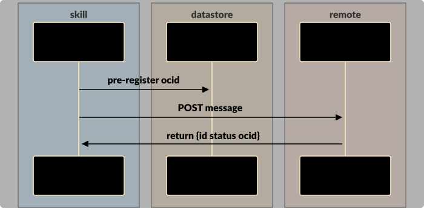
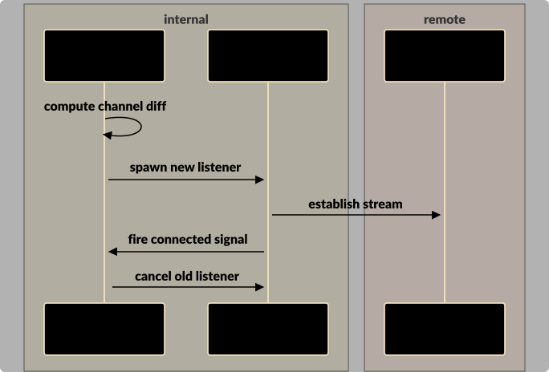
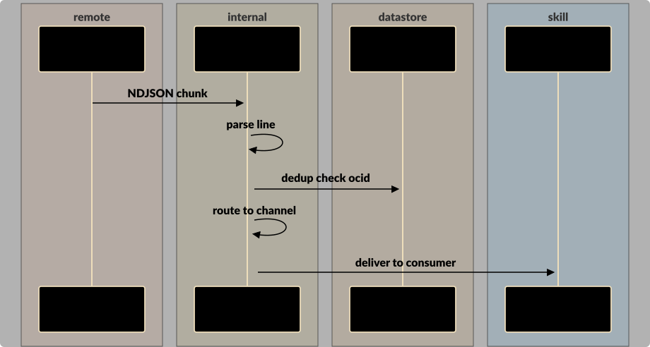

# sdc-rs - Architecture

> ⚠️ Automatically generated from related JSONL file; maintain using the Eidos Architect skill.

*local; draft — ARCH-cvf78wynz2*

Rust client library for DRED — channel subscription, message posting, channel management, Ed25519 signing, and reliable reconnection

**Activities**:

- Subscribe to DRED channels via NDJSON streaming with per-channel async receivers
- Post messages and manage channels (list/create/encrypted-create) via REST
- Rotate connections gracefully when subscribed channel set changes

**Responsibilities**:

- Deduplicate incoming messages via two-generation rotating HashSet keyed on ocid
- Detect dead connections via heartbeat watchdog (3x server interval)
- Suppress sender's own echo by pre-registering ocid in dedup before posting
- Sign channel names with Ed25519 for encrypted channel ownership proofs
- Provide per-listener child CancellationTokens so individual subscriptions can be stopped without affecting others


**Maturity**:

- draft: 13/13

## In this document

[Components and Concerns](#components-and-concerns)&nbsp;&nbsp; [Components](#components)&nbsp;&nbsp; [Related](#related)&nbsp;&nbsp; [Interactions](#interactions)&nbsp;&nbsp; [Data Flows](#data-flows)&nbsp;&nbsp; [Software Objects](#software-objects)&nbsp;&nbsp; [Design Patterns](#design-patterns)&nbsp;&nbsp; [Files](#files)&nbsp;&nbsp; [Collaboration Summary](#collaboration-summary)&nbsp;&nbsp; [Open Questions](#open-questions)&nbsp;&nbsp; [Discovery Notes](#discovery-notes)

## Components and Concerns


- [Deduplicator](#deduplicator-arch-45xbc3x4kv) (internal): Two-generation rotating HashSet for ocid-based message deduplication — shared across reconnections via Arc, poison-safe
- [DredListener](#dredlistener-arch-3fefwgwn51) (internal): Internal streaming listener — connects to /channels/listen, parses NDJSON, deduplicates, routes to per-channel senders
- [DredSubscription](#dredsubscription-arch-rq9recpdkw) (internal): Managed subscription handle — owns listener task, per-channel receivers, supports connection rotation via update_channels()
- [Identity](#identity-arch-m8tpvnmhac) (internal): Ed25519 signing identity — wraps dryoc crypto_sign_detached, wire-compatible with TS StringNacl


## Components

<a id="deduplicator-arch-45xbc3x4kv"></a>

### Component: Deduplicator (internal; draft - ARCH-45xbc3x4kv)

Two-generation rotating HashSet for ocid-based message deduplication — shared across reconnections via Arc, poison-safe

**Activities**:

- Track seen ocids across a 30-60s window using current/previous generation rotation


**Concerns and Responsibilities**:
- **Responsibility**: Bound memory by rotating generations every 30s (configurable)
- **Responsibility**: Survive mutex poisoning via PoisonError::into_inner recovery
- **Responsibility**: Support concurrent access from multiple listeners and the post_message pre-dedup path


**Interactions**: [Post Message](#interaction-ARCH-sg4xpddjpa)

**Data Flows**: [Message Delivery Pipeline](#dataflow-ARCH-j0ab5z6f86)


---

<a id="dredlistener-arch-3fefwgwn51"></a>

### Component: DredListener (internal; draft - ARCH-3fefwgwn51)

Internal streaming listener — connects to /channels/listen, parses NDJSON, deduplicates, routes to per-channel senders

**Activities**:

- Maintain persistent NDJSON connection with heartbeat monitoring and reconnection
- Parse messages and route to per-channel mpsc senders after dedup


**Concerns and Responsibilities**:
- **Responsibility**: Monitor heartbeat interval and declare connection dead after 3x timeout
- **Responsibility**: Fire connected_signal oneshot on first parsed message (used by DredSubscription for rotation sequencing)
- **Responsibility**: Reconnect with exponential backoff (reset when connection was alive longer than backoff_max)


**Interactions**: [Subscribe & Stream](#interaction-ARCH-v4d609nzx1), [Connection Rotation](#interaction-ARCH-yt2dsf3f27)

**Data Flows**: [Message Delivery Pipeline](#dataflow-ARCH-j0ab5z6f86)


---

<a id="dredsubscription-arch-rq9recpdkw"></a>

### Component: DredSubscription (internal; draft - ARCH-rq9recpdkw)

Managed subscription handle — owns listener task, per-channel receivers, supports connection rotation via update_channels()

**Activities**:

- Own listener lifecycle and per-channel mpsc senders/receivers
- Rotate connections on channel-set changes (new connects before old cancels)


**Concerns and Responsibilities**:
- **Responsibility**: Preserve existing receivers across rotation for channels present in both old and new sets
- **Responsibility**: Cancel old listener only after new listener's connected signal fires
- **Responsibility**: Clean up failed rotation attempts via CancelGuard drop safety


**Interactions**: [Connection Rotation](#interaction-ARCH-yt2dsf3f27)


---

<a id="identity-arch-m8tpvnmhac"></a>

### Component: Identity (internal; draft - ARCH-m8tpvnmhac)

Ed25519 signing identity — wraps dryoc crypto_sign_detached, wire-compatible with TS StringNacl

**Activities**:

- Sign strings and verify detached Ed25519 signatures with base64-encoded wire format


**Concerns and Responsibilities**:
- **Responsibility**: Match TS client StringNacl wire format (64-byte detached sig over UTF-8 bytes base64-encoded)
- **Responsibility**: Support keypair persistence via base64 export/import


---


### Nested Components

> These components declare a `parentComponent` and should each have a separate architectural breakdown document. The summary here is a placeholder until that breakdown exists.

| Component | Parent | Summary |
|-----------|--------|---------|
| [Deduplicator](#deduplicator-arch-45xbc3x4kv) | [sdc-rs](#sdc-rs-arch-cvf78wynz2) | Two-generation rotating HashSet for ocid-based message deduplication — shared across reconnections via Arc, poison-safe |
| [DredListener](#dredlistener-arch-3fefwgwn51) | [sdc-rs](#sdc-rs-arch-cvf78wynz2) | Internal streaming listener — connects to /channels/listen, parses NDJSON, deduplicates, routes to per-channel senders |
| [DredSubscription](#dredsubscription-arch-rq9recpdkw) | [sdc-rs](#sdc-rs-arch-cvf78wynz2) | Managed subscription handle — owns listener task, per-channel receivers, supports connection rotation via update_channels() |
| [Identity](#identity-arch-m8tpvnmhac) | [sdc-rs](#sdc-rs-arch-cvf78wynz2) | Ed25519 signing identity — wraps dryoc crypto_sign_detached, wire-compatible with TS StringNacl |


## Related

> Surrogate components — full records live in other `.arch.jsonl` files. Shown here with their context-scoped role in this subsystem.

<a id="dredclient-ts-parent-arch-tzc3wvfm4g"></a>

### DredClient (TS parent) (surrogate ARCH-tzc3wvfm4g of ARCH-yjznx2s7w1)

TS DredClient — the parent architecture's client component that sdc-rs reimplements a subset of

> sdc-rs is a Rust reimplementation of a pragmatic subset of this TS component's functionality


---

<a id="dredserver-arch-bg9vnp08ka"></a>

### DredServer (surrogate ARCH-bg9vnp08ka of ARCH-ahm6njveq4)

DRED server node — the remote endpoint that sdc-rs connects to

> sdc-rs connects to DredServer for all HTTP and streaming operations


---


## Interactions


<a id="interaction-ARCH-v4d609nzx1"></a>

### Interaction: Subscribe & Stream (draft - ARCH-v4d609nzx1)

[sdc-rs](#sdc-rs-arch-cvf78wynz2), [DredListener](#dredlistener-arch-3fefwgwn51), [DredServer](#dredserver-arch-bg9vnp08ka)

Client subscribes to channels, server streams NDJSON messages through a persistent connection





---

<a id="interaction-ARCH-sg4xpddjpa"></a>

### Interaction: Post Message (draft - ARCH-sg4xpddjpa)

[sdc-rs](#sdc-rs-arch-cvf78wynz2), [Deduplicator](#deduplicator-arch-45xbc3x4kv), [DredServer](#dredserver-arch-bg9vnp08ka)

Client posts a message to a channel with echo suppression via pre-dedup





---

<a id="interaction-ARCH-yt2dsf3f27"></a>

### Interaction: Connection Rotation (draft - ARCH-yt2dsf3f27)

[DredSubscription](#dredsubscription-arch-rq9recpdkw), [DredListener](#dredlistener-arch-3fefwgwn51), [DredServer](#dredserver-arch-bg9vnp08ka)

Subscription rotates connection when channel set changes — new connects before old cancels





---


## Data Flows


<a id="dataflow-ARCH-j0ab5z6f86"></a>

### Message Delivery Pipeline (draft - ARCH-j0ab5z6f86)

Server → NDJSON stream → line parse → heartbeat filter → dedup check → per-channel routing → mpsc receiver
**Trigger**: Server flushes an NDJSON line on the chunked HTTP response

1. **[DredServer](#dredserver-arch-bg9vnp08ka)** → **[DredListener](#dredlistener-arch-3fefwgwn51)**: NDJSON chunk
2. **[DredListener](#dredlistener-arch-3fefwgwn51)** → **[DredListener](#dredlistener-arch-3fefwgwn51)**: parse line
3. **[DredListener](#dredlistener-arch-3fefwgwn51)** → **[Deduplicator](#deduplicator-arch-45xbc3x4kv)**: dedup check ocid
4. **[DredListener](#dredlistener-arch-3fefwgwn51)** → **[DredListener](#dredlistener-arch-3fefwgwn51)**: route to channel
5. **[DredListener](#dredlistener-arch-3fefwgwn51)** → **[sdc-rs](#sdc-rs-arch-cvf78wynz2)**: deliver to consumer

**Postconditions**: Message delivered to exactly one consumer (or dropped if no receiver for that channel)





## Software Objects


### DredMessage (struct; draft - ARCH-g8c42ppsqf)

**Component**: sdc-rs (ARCH-cvf78wynz2)
**Source**: `src/lib.rs`

```
pub struct DredMessage { mid, channel, msg_type, nbh, msg, ocid: Option<String>, extra: Map<String, Value> }
```

Serde struct for NDJSON wire format — known fields typed, extras captured via #[serde(flatten)]


### DredError (enum; draft - ARCH-mra1ws64y7)

**Component**: sdc-rs (ARCH-cvf78wynz2)
**Source**: `src/lib.rs`

```
pub enum DredError { Transport(reqwest::Error), ServerStatus(StatusCode), Protocol(String), StreamEnded, Cancelled }
```

Enumerated error type (Send+Sync+'static) with source() chaining for Transport variant


## Design Patterns


## Files


## Collaboration Summary


## Open Questions


## Discovery Notes


