# sdc-rs - Architecture

> **🏗️ ARCHITECTURE TRIGGER: READ THIS FIRST**
>
> This architecture document is strictly managed. Before interpreting, implementing, or discussing architectural decisions, you **MUST** read and apply the **Architecture Consumer Skill** at:
>
> `architect/architect-consumer.SKILL.md`
>
> **CRITICAL**: You are **FORBIDDEN** from modifying this file or making architectural changes until you have ingested the "Read-Only" constraints and "Escalation Protocol" defined in that skill.
> NOTE: If you've already studied the full Architect skill (`architect/architect.SKILL.md`), you don't need the consumer skill.


**Maturity**:

- vetted-in-experience: 41/52
- draft: 10/52
- stable: 1/52

## Components and Concerns


- [Deduplicator](#deduplicator-arch-xqjpk4fzdg) (internal): Two-generation rotating HashSet keyed on ocid. Rotates every 30s: current → previous, previous dropped. Bounds memory to a 30-60s window while catching duplicates across reconnections.
- [DredClient](#dredclient-arch-f8bv876rfx) (internal): Arc-backed shared state holder — HTTP connection pool, client_id, deduplicator, cancellation root, backoff config, channel buffer size. Provides request/response API and creates subscriptions.
- [DredListener](#dredlistener-arch-afp408rkyz) (internal): Internal streaming worker. Maintains a persistent NDJSON connection to /channels/listen, parses lines, deduplicates by ocid, and routes messages to per-channel mpsc senders. Auto-reconnects on failure.
- [DredListener (replacement)](#dredlistener-replacement-arch-tgm3w99ket) (internal): Surrogate for the incoming DredListener spawned during a connection rotation. Architecturally the same component as ARCH-afp408rkyz — this proxy exists so the Graceful Connection Rotation dataflow can distinguish the new listener from the old one during their brief overlap.
- [DredServer](#dredserver-arch-xakvgft09j) (remote): DRED node process (TypeScript) — Express HTTP + Redis Streams relay, channel management, server-side dedup, heartbeat emission.
- [DredSubscription](#dredsubscription-arch-yhkfr4x56c) (internal): Managed subscription handle returned by DredClient::subscribe. Owns the current listener task, exposes per-channel receivers, and supports lossless channel-set rotation via update_channels.
- [Identity](#identity-arch-6tqg5gvypa) (internal): Ed25519 signing keypair (via dryoc) used for channel-ownership proofs. Wire format matches the TS client's StringNacl: base64 64-byte detached signatures over UTF-8 bytes.
- [sdc-rs](#sdc-rs-arch-9bqqbc4atk) (local): Rust client library for DRED — pragmatic subset of dred-client implementing channel subscription, message posting, channel management, Ed25519 ownership signing, and reliable reconnection.


### Concerns

| Concern | Type | Owner | Contributors | Depends On |
|---------|------|-------|-------------|------------|
| NDJSON Message Stream | artifact | [DredListener](#dredlistener-arch-afp408rkyz) | [DredServer](#dredserver-arch-xakvgft09j) | [DredSubscription](#dredsubscription-arch-yhkfr4x56c) |
| OCID Dedup Set | resource | [Deduplicator](#deduplicator-arch-xqjpk4fzdg) | - | [DredListener](#dredlistener-arch-afp408rkyz), [DredClient](#dredclient-arch-f8bv876rfx) |
| Per-Channel Message Queues | resource | [DredSubscription](#dredsubscription-arch-yhkfr4x56c) | - | [dApp Consumer](#actors), [DredListener](#dredlistener-arch-afp408rkyz) |
| Cancellation Hierarchy | resource | [DredClient](#dredclient-arch-f8bv876rfx) | - | [DredSubscription](#dredsubscription-arch-yhkfr4x56c), [DredListener](#dredlistener-arch-afp408rkyz) |
| Heartbeat Deadline | artifact | [DredListener](#dredlistener-arch-afp408rkyz) | [DredServer](#dredserver-arch-xakvgft09j) | - |
| HTTP Connection Pool | resource | [DredClient](#dredclient-arch-f8bv876rfx) | - | [DredListener](#dredlistener-arch-afp408rkyz), [DredClient](#dredclient-arch-f8bv876rfx) |
| Subscribed Channel List | artifact | [DredSubscription](#dredsubscription-arch-yhkfr4x56c) | - | [DredListener](#dredlistener-arch-afp408rkyz) |
| Ed25519 Keypair | artifact | [Identity](#identity-arch-6tqg5gvypa) | - | [DredClient](#dredclient-arch-f8bv876rfx) |


## Components

<a id="deduplicator-arch-xqjpk4fzdg"></a>

### Component: Deduplicator (internal - ARCH-xqjpk4fzdg)

Two-generation rotating HashSet keyed on ocid. Rotates every 30s: current → previous, previous dropped. Bounds memory to a 30-60s window while catching duplicates across reconnections.

**Activities**:

- Check-and-insert ocids against two generations of HashSet
- Rotate generations lazily when the rotation interval has elapsed
- Clone cheaply via Arc<Mutex<_>> for sharing across reconnections and tasks


**Concerns and Responsibilities**:
- Owns: **OCID Dedup Set** - Two generations of HashSet<String>, rotated every 30s. Shared via Arc<Mutex<_>> across all listeners spawned from the same DredClient.
- **Responsibility**: Return true exactly once per unique ocid observed within the 30-60s window
- **Responsibility**: Drop the previous generation on rotation so total memory stays bounded regardless of connection lifetime
- **Responsibility**: Recover from mutex poisoning via PoisonError::into_inner so a panic in another thread doesn't brick future dedup checks
- **Responsibility**: Perform rotation check on every call so rotation happens even if no external timer ticks


**Interactions**: [Message Posting](#interaction-ARCH-h0jsqt24dr), [Connection Rotation](#interaction-ARCH-mv4sacp742)

**Data Flows**: [Inbound Message Flow](#dataflow-ARCH-w6hbze8gn2), [Outbound Message with Echo Suppression](#dataflow-ARCH-rq16c8ftaa), [Graceful Connection Rotation](#dataflow-ARCH-h2ehf4jh0w)


---

<a id="dredclient-arch-f8bv876rfx"></a>

### Component: DredClient (internal - ARCH-f8bv876rfx)

Arc-backed shared state holder — HTTP connection pool, client_id, deduplicator, cancellation root, backoff config, channel buffer size. Provides request/response API and creates subscriptions.

**Activities**:

- Expose builder-pattern construction with sensible defaults
- Issue HTTP POST/GET requests for post_message, list_channels, create_channel
- Spawn new DredListener tasks when subscribe() is called


**Concerns and Responsibilities**:
- Owns: **Cancellation Hierarchy** - tokio_util CancellationToken tree. Root lives on SharedInner; each listener owns a child. Cancelling the root terminates all listeners; cancelling a child terminates only that listener.
- Owns: **HTTP Connection Pool** - reqwest::Client held on SharedInner. reqwest maintains its own internal keepalive pool, so a single Client is shared across all listeners and request/response calls spawned from the same DredClient.
- Depends on: **OCID Dedup Set** - Pre-registers outbound ocids via check() before posting so the sender's own echo is suppressed
- Depends on: **HTTP Connection Pool** - Uses http directly for post_message, list_channels, create_channel
- Depends on: **Ed25519 Keypair** - Calls identity.public_key_base64() for owner and identity.sign_string(name) for signature in create_encrypted_channel
- **Responsibility**: Own and share the Deduplicator, reqwest::Client, and root CancellationToken across all listeners spawned from this client
- **Responsibility**: Pre-register posted ocids in the deduplicator before transmission, ensuring the sender's echo is suppressed from its own listener
- **Responsibility**: Generate client_id as a 10-char lowercase-Crockford nanoid when not supplied
- **Responsibility**: Reject encrypted=true on create_channel() and direct callers to create_encrypted_channel()
- **Responsibility**: Stamp every outbound request with the clientid header
- **Responsibility**: Return typed DredError for transport, server status, and protocol failures


**Interactions**: [Message Posting](#interaction-ARCH-h0jsqt24dr), [Channel Management](#interaction-ARCH-gcazcky108), [Cancellation Propagation](#interaction-ARCH-gd5p7mrhx8)

**Data Flows**: [Outbound Message with Echo Suppression](#dataflow-ARCH-rq16c8ftaa), [Encrypted Channel Creation](#dataflow-ARCH-y63gmb1p7q)


---

<a id="dredlistener-arch-afp408rkyz"></a>

### Component: DredListener (internal - ARCH-afp408rkyz)

Internal streaming worker. Maintains a persistent NDJSON connection to /channels/listen, parses lines, deduplicates by ocid, and routes messages to per-channel mpsc senders. Auto-reconnects on failure.

**Activities**:

- POST to /channels/listen with subscription config and stream chunked NDJSON
- Parse line-delimited JSON, consume heartbeat-info/heartbeat frames, route everything else
- Reconnect with exponential backoff (500ms → 30s) on stream end or transport failure


**Supports Requirements**: REQT-hfmveq25qc

**Concerns and Responsibilities**:
- Owns: **NDJSON Message Stream** - Chunked newline-delimited JSON wire stream over HTTP response from POST /channels/listen. Fields: mid, channel, type, nbh, msg, ocid, plus flatten extra.
- Owns: **Heartbeat Deadline** - tokio::time::Instant — reset to now+3×interval on each heartbeat. Missed deadline causes the connection to be declared dead (DredError::StreamEnded), triggering reconnect.
- Depends on: **OCID Dedup Set** - Calls check(ocid) on every eligible inbound message to suppress replays across reconnections
- Depends on: **Per-Channel Message Queues** - Holds mpsc::Senders keyed by channel name; send() for each routed message
- Depends on: **Cancellation Hierarchy** - Selects on cancel.cancelled() in the connect/reconnect loops and returns DredError::Cancelled promptly
- Depends on: **HTTP Connection Pool** - Uses shared.http for the streaming POST to /channels/listen
- Depends on: **Subscribed Channel List** - Includes each channel name in the POST /channels/listen body as a ChannelSubConfig
- **Responsibility**: Interpret the first heartbeat-info message to learn the server's heartbeat interval, and thereafter declare the connection dead if no heartbeat arrives within 3x that interval
- **Responsibility**: Consume heartbeat-info and heartbeat frames internally without forwarding them to consumer channels
- **Responsibility**: Invoke Deduplicator::check(ocid) on every eligible message and drop duplicates
- **Responsibility**: Send each unique message on the sender for its channel field, dropping messages whose channel has no sender
- **Responsibility**: Fire the optional connected_signal oneshot on first successful parse, for rotation sequencing
- **Responsibility**: Reset backoff to the initial value when the prior connection was alive longer than backoff_max
- **Responsibility**: Return DredError::Cancelled promptly when its CancellationToken fires, at any point in the loop


**Interactions**: [Streaming Subscription](#interaction-ARCH-xtk1154efq), [Connection Rotation](#interaction-ARCH-mv4sacp742), [Cancellation Propagation](#interaction-ARCH-gd5p7mrhx8)

**Data Flows**: [Inbound Message Flow](#dataflow-ARCH-w6hbze8gn2), [Outbound Message with Echo Suppression](#dataflow-ARCH-rq16c8ftaa), [Graceful Connection Rotation](#dataflow-ARCH-h2ehf4jh0w), [Reconnect with Exponential Backoff](#dataflow-ARCH-hfgcy3187z)


---

<a id="dredlistener-replacement-arch-tgm3w99ket"></a>

### Component: DredListener (replacement) (internal - ARCH-tgm3w99ket)

Surrogate for the incoming DredListener spawned during a connection rotation. Architecturally the same component as ARCH-afp408rkyz — this proxy exists so the Graceful Connection Rotation dataflow can distinguish the new listener from the old one during their brief overlap.

**Activities**:

- POST to /channels/listen with the updated subscription config
- Parse chunked NDJSON and fire connected_signal on first successful parse
- Take over as the subscription's active listener after the handoff completes


**Concerns and Responsibilities**:
- **Responsibility**: Establish a live stream to DredServer before the old listener is cancelled, so no window exists in which neither listener is receiving
- **Responsibility**: Route any messages received during the overlap through the shared Deduplicator, so the old listener's concurrent delivery of the same ocid is suppressed


**Data Flows**: [Graceful Connection Rotation](#dataflow-ARCH-h2ehf4jh0w)


---

<a id="dredserver-arch-xakvgft09j"></a>

### Component: DredServer (remote - ARCH-xakvgft09j)

DRED node process (TypeScript) — Express HTTP + Redis Streams relay, channel management, server-side dedup, heartbeat emission.

**Activities**:

- Ingest POSTed messages and stream them back via NDJSON /channels/listen
- Validate channel-ownership signatures on encrypted channel creation
- Emit periodic heartbeat frames to connected clients


**Concerns and Responsibilities**:
- Contributes to: **NDJSON Message Stream** - Emits each line of the NDJSON stream, including heartbeat-info, heartbeat, and channel messages
- Contributes to: **Heartbeat Deadline** - Advances the deadline on every heartbeat-info and heartbeat frame the server emits
- **Responsibility**: Emit the initial heartbeat-info frame with timerInterval, then periodic heartbeat frames
- **Responsibility**: Deduplicate by composite channel/ocid per REQT-p5c4tcz2r7 before publishing to streams
- **Responsibility**: Verify owner+signature against the posted channel name before creating an encrypted channel


**Interactions**: [Streaming Subscription](#interaction-ARCH-xtk1154efq), [Message Posting](#interaction-ARCH-h0jsqt24dr), [Channel Management](#interaction-ARCH-gcazcky108), [Connection Rotation](#interaction-ARCH-mv4sacp742)

**Data Flows**: [Inbound Message Flow](#dataflow-ARCH-w6hbze8gn2), [Outbound Message with Echo Suppression](#dataflow-ARCH-rq16c8ftaa), [Graceful Connection Rotation](#dataflow-ARCH-h2ehf4jh0w), [Encrypted Channel Creation](#dataflow-ARCH-y63gmb1p7q), [Reconnect with Exponential Backoff](#dataflow-ARCH-hfgcy3187z)


---

<a id="dredsubscription-arch-yhkfr4x56c"></a>

### Component: DredSubscription (internal - ARCH-yhkfr4x56c)

Managed subscription handle returned by DredClient::subscribe. Owns the current listener task, exposes per-channel receivers, and supports lossless channel-set rotation via update_channels.

**Activities**:

- Hand out per-channel mpsc receivers on demand via take_receiver
- Rotate the listener task when the channel set changes, without losing messages
- Cancel the active listener when dropped


**Concerns and Responsibilities**:
- Owns: **Per-Channel Message Queues** - HashMap<String, mpsc::Sender<DredMessage>> (listener side) + HashMap<String, mpsc::Receiver<DredMessage>> (subscription side). Senders are cloned across rotation to preserve consumer-held receivers.
- Owns: **Subscribed Channel List** - Vec<String> mirrored on DredSubscription and the active DredListener. On rotation, a diff drives which senders are reused, which are added, and which receivers are dropped.
- Depends on: **NDJSON Message Stream** - Receives routed messages indirectly via the per-channel mpsc queues the listener fills
- Depends on: **Cancellation Hierarchy** - Creates child tokens for each listener via shared.cancel.child_token(); cancels the current child on Drop and on rotation completion
- **Responsibility**: Preserve existing senders for channels present in both old and new subscription sets so consumer-held receivers keep working seamlessly
- **Responsibility**: Spawn the new listener and wait for its connected_signal before cancelling the old one, so both connections briefly coexist and route through the same dedup
- **Responsibility**: Abort rotation and keep the old listener if the new listener fails to connect within connect_timeout
- **Responsibility**: Drop receivers for removed channels and allocate fresh receivers for added channels
- **Responsibility**: Arm a CancelGuard during rotation so a mid-flight panic doesn't leak the new listener task
- **Responsibility**: Cancel the current listener's CancellationToken on Drop


**Interactions**: [Connection Rotation](#interaction-ARCH-mv4sacp742), [Cancellation Propagation](#interaction-ARCH-gd5p7mrhx8)

**Data Flows**: [Graceful Connection Rotation](#dataflow-ARCH-h2ehf4jh0w)


---

<a id="identity-arch-6tqg5gvypa"></a>

### Component: Identity (internal - ARCH-6tqg5gvypa)

Ed25519 signing keypair (via dryoc) used for channel-ownership proofs. Wire format matches the TS client's StringNacl: base64 64-byte detached signatures over UTF-8 bytes.

**Activities**:

- Generate fresh Ed25519 keypairs via dryoc::classic::crypto_sign
- Sign UTF-8 strings and return base64 detached signatures
- Verify base64-encoded signatures against a base64 public key


**Concerns and Responsibilities**:
- Owns: **Ed25519 Keypair** - 32-byte public key + 64-byte secret key (dryoc format, matching libsodium). Treated as sensitive; secret_key_base64() is the only persistence hook.
- **Responsibility**: Guarantee wire-format compatibility with the TS client's StringNacl (base64 64-byte signatures, base64 32-byte public keys)
- **Responsibility**: Validate key byte-length at construction so sign_string can safely expect() on the crypto call
- **Responsibility**: Reject malformed base64, wrong-length keys, and wrong-length signatures during verification without panicking
- **Responsibility**: Expose secret_key_base64 only as an explicit persistence hook (treat-as-sensitive contract is on the caller)


**Interactions**: [Channel Management](#interaction-ARCH-gcazcky108)

**Data Flows**: [Encrypted Channel Creation](#dataflow-ARCH-y63gmb1p7q)


---

<a id="sdc-rs-arch-9bqqbc4atk"></a>

### Component: sdc-rs (local - ARCH-9bqqbc4atk)

Rust client library for DRED — pragmatic subset of dred-client implementing channel subscription, message posting, channel management, Ed25519 ownership signing, and reliable reconnection.

**Activities**:

- Connect to DRED servers over NDJSON streaming and deliver per-channel async message streams
- Post, list, and create channels (plaintext or Ed25519-signed encrypted)
- Rotate connections gracefully when the subscribed channel set changes


**Supports Requirements**: REQT-p5c4tcz2r7, REQT-hfmveq25qc

**Concerns and Responsibilities**:
- **Responsibility**: Deduplicate inbound messages by ocid across reconnections via shared two-generation rotating set
- **Responsibility**: Suppress the sender's own echo by pre-registering posted ocids before transmission
- **Responsibility**: Detect dead connections via heartbeat watchdog (3x server interval) and reconnect with exponential backoff
- **Responsibility**: Route each NDJSON line to exactly one per-channel mpsc receiver
- **Responsibility**: Preserve receivers for channels that persist across an update_channels rotation
- **Responsibility**: Guarantee no message loss or duplication during connection rotation via shared deduplicator
- **Responsibility**: Match the TypeScript client's StringNacl wire format for Ed25519 signatures and public keys
- **Responsibility**: Expose Send+Sync-safe types so consumers can move the client freely across async tasks
- **Responsibility**: Survive mutex poisoning in the deduplicator without bricking future dedup checks


---


### Nested Components

> These components declare a `parentComponent` and should each have a separate architectural breakdown document. The summary here is a placeholder until that breakdown exists.

| Component | Parent | Summary |
|-----------|--------|---------|
| [Deduplicator](#deduplicator-arch-xqjpk4fzdg) | [sdc-rs](#sdc-rs-arch-9bqqbc4atk) | Two-generation rotating HashSet keyed on ocid. Rotates every 30s: current → previous, previous dropped. Bounds memory to a 30-60s window while catching duplicates across reconnections. |
| [DredClient](#dredclient-arch-f8bv876rfx) | [sdc-rs](#sdc-rs-arch-9bqqbc4atk) | Arc-backed shared state holder — HTTP connection pool, client_id, deduplicator, cancellation root, backoff config, channel buffer size. Provides request/response API and creates subscriptions. |
| [DredListener](#dredlistener-arch-afp408rkyz) | [sdc-rs](#sdc-rs-arch-9bqqbc4atk) | Internal streaming worker. Maintains a persistent NDJSON connection to /channels/listen, parses lines, deduplicates by ocid, and routes messages to per-channel mpsc senders. Auto-reconnects on failure. |
| [DredListener (replacement)](#dredlistener-replacement-arch-tgm3w99ket) | [sdc-rs](#sdc-rs-arch-9bqqbc4atk) | Surrogate for the incoming DredListener spawned during a connection rotation. Architecturally the same component as ARCH-afp408rkyz — this proxy exists so the Graceful Connection Rotation dataflow can distinguish the new listener from the old one during their brief overlap. |
| [DredSubscription](#dredsubscription-arch-yhkfr4x56c) | [sdc-rs](#sdc-rs-arch-9bqqbc4atk) | Managed subscription handle returned by DredClient::subscribe. Owns the current listener task, exposes per-channel receivers, and supports lossless channel-set rotation via update_channels. |
| [Identity](#identity-arch-6tqg5gvypa) | [sdc-rs](#sdc-rs-arch-9bqqbc4atk) | Ed25519 signing keypair (via dryoc) used for channel-ownership proofs. Wire format matches the TS client's StringNacl: base64 64-byte detached signatures over UTF-8 bytes. |


## Actors


External participants who interact with the system:

| ARCH-UUT | Name | Description |
|----------|------|-------------|
| ARCH-zmxjxzc2yp | dApp Consumer | Rust application code that links sdc-rs, constructs a DredClient, subscribes to channels, and posts messages. May hold the client across many async tasks (Clone is cheap) and consumes per-channel mpsc::Receivers. |
| ARCH-x7dsqz1m41 | Other dApp instance | Another Rust application using sdc-rs (or any DRED client), running somewhere else, posting messages to the same channel our Consumer is subscribed to. |


## Interactions


<a id="interaction-ARCH-xtk1154efq"></a>

### Interaction: Streaming Subscription (async_trigger - ARCH-xtk1154efq)

[DredListener](#dredlistener-arch-afp408rkyz), [DredServer](#dredserver-arch-xakvgft09j) - Trigger: DredListener::run spawned from DredClient::subscribe

DredListener opens a persistent chunked NDJSON stream from DredServer's POST /channels/listen, receives subscription frames, and interprets heartbeat frames to keep the deadline fresh.

**Payload**: Request: JSON array of {channel, options:{bookmark?}}; Response: chunked application/ndjson lines, each a DredMessage

**Errors**:

- ServerStatus if /channels/listen returns non-2xx
- Transport on reqwest stream errors
- StreamEnded on connection close or missed heartbeat
- Cancelled when the listener's CancellationToken fires
**Supports Requirements**: REQT-hfmveq25qc



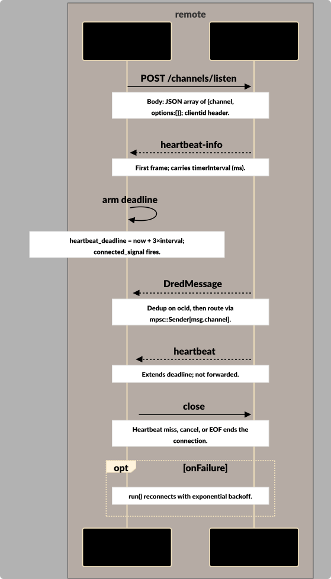


---

<a id="interaction-ARCH-h0jsqt24dr"></a>

### Interaction: Message Posting (library_call - ARCH-h0jsqt24dr)

[DredClient](#dredclient-arch-f8bv876rfx), [Deduplicator](#deduplicator-arch-xqjpk4fzdg), [DredServer](#dredserver-arch-xakvgft09j) - Trigger: Consumer calls DredClient::post_message(channel, msg, type, ocid?)

DredClient posts a message to a channel. The ocid is pre-registered in the Deduplicator before transmission so the sender's own listener ignores the echoed message when it arrives on the NDJSON stream.

**Payload**: Request JSON: {msg, type, ocid}; Response JSON: {id, status, ocid}

**Errors**:

- Transport on reqwest failure
- ServerStatus on non-2xx HTTP response


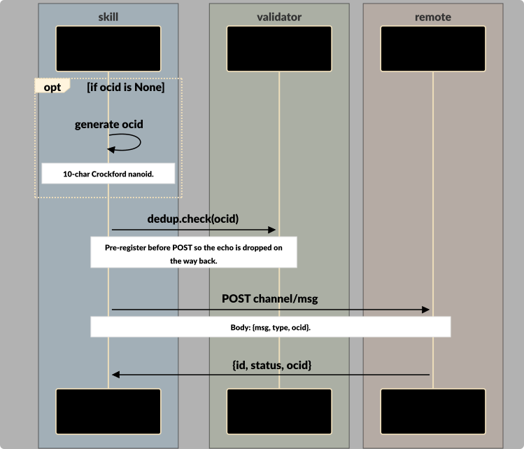


---

<a id="interaction-ARCH-gcazcky108"></a>

### Interaction: Channel Management (library_call - ARCH-gcazcky108)

[DredClient](#dredclient-arch-f8bv876rfx), [Identity](#identity-arch-6tqg5gvypa), [DredServer](#dredserver-arch-xakvgft09j) - Trigger: Consumer calls list_channels / create_channel / create_encrypted_channel on DredClient

Request/response HTTP calls for listing and creating channels. Create supports both plaintext and Ed25519-signed encrypted variants; encrypted create involves the Identity component to produce the owner+signature pair.

**Payload**: GET /channels → {channels:[names]}; POST /channel/{name} with CreateChannelOptions → CreateChannelResponse

**Errors**:

- Protocol if create_channel is called with options.encrypted=true (directs caller to create_encrypted_channel)
- ServerStatus on non-2xx
- Protocol on JSON deserialization failure or invalid base64 keys




---

<a id="interaction-ARCH-mv4sacp742"></a>

### Interaction: Connection Rotation (internal_call - ARCH-mv4sacp742)

[DredSubscription](#dredsubscription-arch-yhkfr4x56c), [DredListener](#dredlistener-arch-afp408rkyz), [Deduplicator](#deduplicator-arch-xqjpk4fzdg), [DredServer](#dredserver-arch-xakvgft09j) - Trigger: Consumer calls DredSubscription::update_channels(new_channels)

DredSubscription replaces its active DredListener with a new one for an updated channel set. The new listener must fire its connected_signal before the old one is cancelled, so both connections briefly coexist routing through the shared Deduplicator.

**Payload**: new Vec<String> channel list; internal oneshot signal connected_signal

**Errors**:

- Protocol: new listener exited before establishing connection
- Protocol: new connection not established within connect_timeout



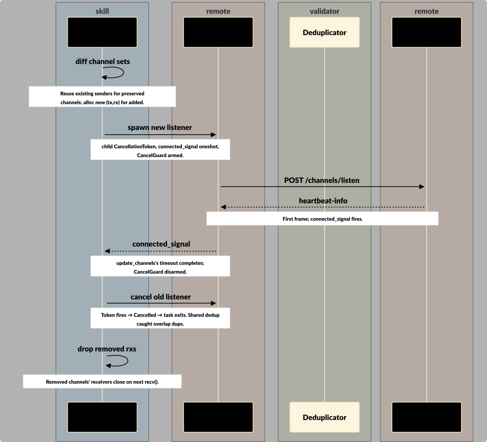


---

<a id="interaction-ARCH-gd5p7mrhx8"></a>

### Interaction: Cancellation Propagation (event - ARCH-gd5p7mrhx8)

[DredClient](#dredclient-arch-f8bv876rfx), [DredSubscription](#dredsubscription-arch-yhkfr4x56c), [DredListener](#dredlistener-arch-afp408rkyz) - Trigger: Consumer cancels via DredClient::cancellation_token().cancel(), or DredSubscription Drop, or explicit subscription.cancellation_token().cancel()

CancellationToken hierarchy: DredClient holds the root; each DredSubscription creates a child when subscribing; that child is what DredListener selects on. Cancelling the root stops all listeners; cancelling a child stops only that listener.

**Payload**: CancellationToken state (cancelled/not cancelled)




---


## Data Flow


<a id="dataflow-ARCH-w6hbze8gn2"></a>

### Inbound Message Flow (ARCH-w6hbze8gn2)

From NDJSON line on the wire to a message landing in the consumer's per-channel mpsc::Receiver. Shows dedup, heartbeat consumption, and channel routing.
**Trigger**: A chunk arrives on the bytes_stream from /channels/listen
**Preconditions**: DredListener is connected and the NDJSON response body is being streamed; The shared Deduplicator and the per-channel sender map are both initialized

1. **[DredServer](#dredserver-arch-xakvgft09j)** → **[DredListener](#dredlistener-arch-afp408rkyz)**: NDJSON chunk — Bytes arrive on bytes_stream; listener appends to its string buffer (may contain partial lines).
2. **[DredListener](#dredlistener-arch-afp408rkyz)** → **[DredListener](#dredlistener-arch-afp408rkyz)**: drain newline — Find '\n', drain up to it, trim, skip if empty.
3. **[DredListener](#dredlistener-arch-afp408rkyz)** → **[DredListener](#dredlistener-arch-afp408rkyz)**: parse as JSON — serde_json::from_str::<DredMessage>(line). *(on failure: Warn with raw line and continue — one bad line doesn't break the connection.)*
4. **[DredListener](#dredlistener-arch-afp408rkyz)** → **[DredListener](#dredlistener-arch-afp408rkyz)**: handle heartbeat-info — Read timerInterval; set heartbeat_interval and extend heartbeat_deadline. Continue (not forwarded).
5. **[DredListener](#dredlistener-arch-afp408rkyz)** → **[DredListener](#dredlistener-arch-afp408rkyz)**: handle heartbeat — Extend heartbeat_deadline to now + 3×interval. Continue (not forwarded).
6. **[DredListener](#dredlistener-arch-afp408rkyz)** → **[Deduplicator](#deduplicator-arch-xqjpk4fzdg)**: dedup.check(ocid) — Returns false (drop) if ocid already seen in either generation.
7. **[DredListener](#dredlistener-arch-afp408rkyz)** → **[DredListener](#dredlistener-arch-afp408rkyz)**: route to sender — Look up senders[msg.channel]; drop with debug log if none. *(on failure: If receiver is dropped, send returns Err; log debug and continue.)*
8. **[DredListener](#dredlistener-arch-afp408rkyz)** → **[dApp Consumer](#actors)**: mpsc delivery — Consumer receives via rx.recv() on its take_receiver(channel).

**Postconditions**: Unique message lands in the consumer's mpsc::Receiver for msg.channel; ocid is now present in the Deduplicator's current generation, suppressing duplicates until rotation

**Supports Requirements**: REQT-hfmveq25qc


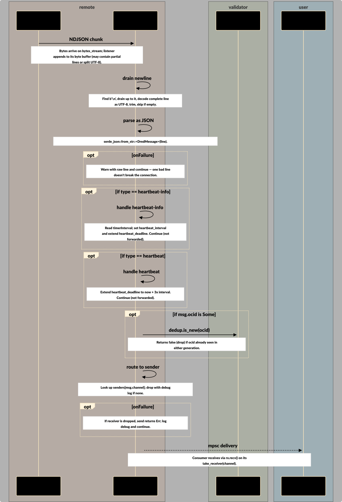


<a id="dataflow-ARCH-rq16c8ftaa"></a>

### Outbound Message with Echo Suppression (ARCH-rq16c8ftaa)

A posted message is pre-registered in the Deduplicator before the HTTP POST, so when the server echoes it back on the NDJSON stream, the sender's own listener drops it as a duplicate.
**Trigger**: Consumer calls DredClient::post_message
**Preconditions**: Consumer has a DredClient and a DredSubscription (may be the same subscription that would otherwise receive the echo)

1. **[dApp Consumer](#actors)** → **[DredClient](#dredclient-arch-f8bv876rfx)**: post_message call — channel, msg, msg_type, optional ocid.
2. **[DredClient](#dredclient-arch-f8bv876rfx)** → **[DredClient](#dredclient-arch-f8bv876rfx)**: generate ocid — gen_id(10) — 10-char Crockford nanoid.
3. **[DredClient](#dredclient-arch-f8bv876rfx)** → **[Deduplicator](#deduplicator-arch-xqjpk4fzdg)**: dedup.check(ocid) — Pre-register. Return value ignored.
4. **[DredClient](#dredclient-arch-f8bv876rfx)** → **[DredServer](#dredserver-arch-xakvgft09j)**: POST /channel/{c}/msg — Body: {msg, type, ocid}. Response: {id, status, ocid}. *(on failure: Non-2xx → ServerStatus; transport → Transport; bad JSON → Protocol.)*
5. **[DredServer](#dredserver-arch-xakvgft09j)** → **[DredListener](#dredlistener-arch-afp408rkyz)**: echo on NDJSON — Server streams the posted message back to the sender's own listener.
6. **[DredListener](#dredlistener-arch-afp408rkyz)** → **[Deduplicator](#deduplicator-arch-xqjpk4fzdg)**: dedup.check(ocid) — Returns false — ocid was pre-registered at step 3. Message dropped.

**Postconditions**: Message is persisted to the server's Redis stream and visible to all other subscribers on the channel; The sender's own listener never forwards the echoed message to the consumer's mpsc::Receiver


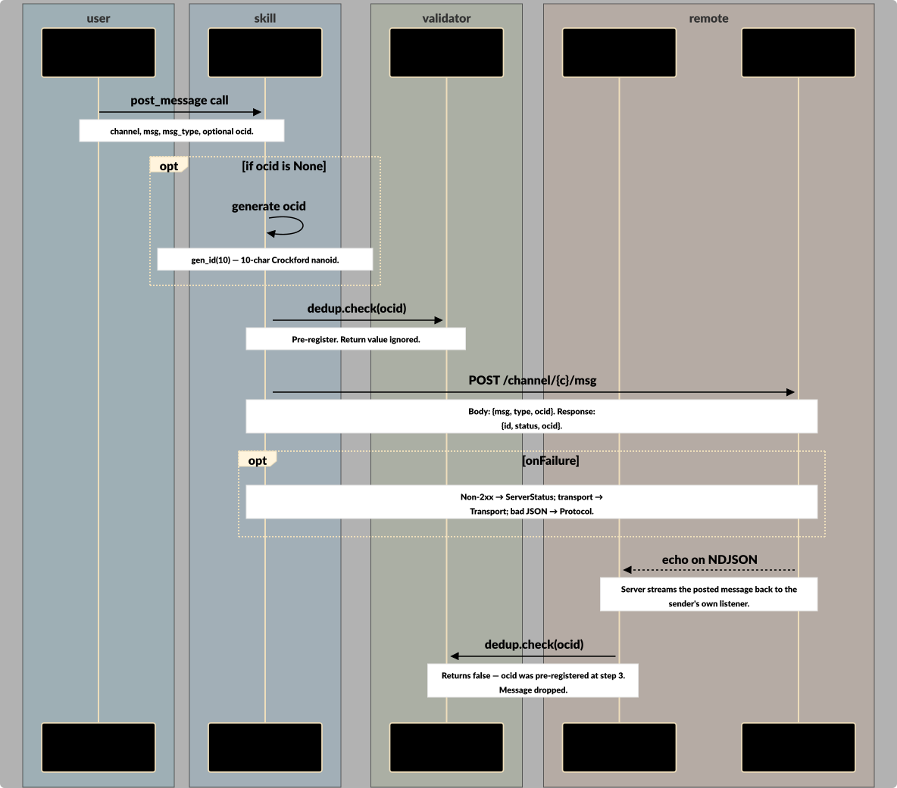


<a id="dataflow-ARCH-h2ehf4jh0w"></a>

### Graceful Connection Rotation (ARCH-h2ehf4jh0w)

update_channels sequencing shown alongside three message deliveries (before, during, and after the switchover). The overlap case demonstrates the key property: a message posted by another dApp instance is delivered exactly once to our Consumer, because both listeners consult the same Deduplicator. See ARCH-tgm3w99ket (replacement surrogate) and ARCH-x7dsqz1m41 (other dApp surrogate).
**Trigger**: Consumer calls DredSubscription::update_channels(new_channels)
**Preconditions**: An existing DredListener (outgoing) is running with the old channel set; The DredClient's shared Deduplicator has recent ocids cached

1. **[Other dApp instance](#actors)** → **[DredServer](#dredserver-arch-xakvgft09j)**: post Message A — BEFORE switchover.
2. **[DredServer](#dredserver-arch-xakvgft09j)** → **[DredListener](#dredlistener-arch-afp408rkyz)**: Message A
3. **[DredListener](#dredlistener-arch-afp408rkyz)** → **[Deduplicator](#deduplicator-arch-xqjpk4fzdg)**: dedup check A — Returns true (new).
4. **[DredListener](#dredlistener-arch-afp408rkyz)** → **[dApp Consumer](#actors)**: deliver A
5. **[dApp Consumer](#actors)** → **[DredSubscription](#dredsubscription-arch-yhkfr4x56c)**: update_channels(new) — SWITCHOVER BEGINS.
6. **[DredSubscription](#dredsubscription-arch-yhkfr4x56c)** → **[DredSubscription](#dredsubscription-arch-yhkfr4x56c)**: diff + reuse senders — Clone existing senders; alloc new (tx,rx) for added channels.
7. **[DredSubscription](#dredsubscription-arch-yhkfr4x56c)** → **[DredListener (replacement)](#dredlistener-replacement-arch-tgm3w99ket)**: spawn replacement — child CancellationToken, connected_signal oneshot. CancelGuard armed.
8. **[DredListener (replacement)](#dredlistener-replacement-arch-tgm3w99ket)** → **[DredServer](#dredserver-arch-xakvgft09j)**: POST /channels/listen
9. **[DredServer](#dredserver-arch-xakvgft09j)** → **[DredListener (replacement)](#dredlistener-replacement-arch-tgm3w99ket)**: heartbeat-info — Replacement's stream is live. *(on failure: If replacement exits early, oneshot drops → update_channels returns Protocol error; CancelGuard cancels.)*
10. **[DredListener (replacement)](#dredlistener-replacement-arch-tgm3w99ket)** → **[DredSubscription](#dredsubscription-arch-yhkfr4x56c)**: connected_signal
11. **[Other dApp instance](#actors)** → **[DredServer](#dredserver-arch-xakvgft09j)**: post Message B — DURING overlap — both listeners live.
12. **[DredServer](#dredserver-arch-xakvgft09j)** → **[DredListener (replacement)](#dredlistener-replacement-arch-tgm3w99ket)**: Message B
13. **[DredListener (replacement)](#dredlistener-replacement-arch-tgm3w99ket)** → **[Deduplicator](#deduplicator-arch-xqjpk4fzdg)**: dedup check B — Returns true (new).
14. **[DredListener (replacement)](#dredlistener-replacement-arch-tgm3w99ket)** → **[dApp Consumer](#actors)**: deliver B — Delivered exactly once.
15. **[DredServer](#dredserver-arch-xakvgft09j)** → **[DredListener](#dredlistener-arch-afp408rkyz)**: Message B (again) — Server also streams to the outgoing listener (still connected).
16. **[DredListener](#dredlistener-arch-afp408rkyz)** → **[Deduplicator](#deduplicator-arch-xqjpk4fzdg)**: dedup check B — Returns false (dup) — outgoing drops it.
17. **[DredSubscription](#dredsubscription-arch-yhkfr4x56c)** → **[DredSubscription](#dredsubscription-arch-yhkfr4x56c)**: guard disarm
18. **[DredSubscription](#dredsubscription-arch-yhkfr4x56c)** → **[DredListener](#dredlistener-arch-afp408rkyz)**: cancel outgoing
19. **[DredSubscription](#dredsubscription-arch-yhkfr4x56c)** → **[DredSubscription](#dredsubscription-arch-yhkfr4x56c)**: swap handles — current_cancel/handle now point at replacement.
20. **[DredSubscription](#dredsubscription-arch-yhkfr4x56c)** → **[DredSubscription](#dredsubscription-arch-yhkfr4x56c)**: drop removed rxs — Removed channels' receivers close on next recv().
21. **[DredListener](#dredlistener-arch-afp408rkyz)** → **[DredListener](#dredlistener-arch-afp408rkyz)**: outgoing exits — DredError::Cancelled → task ends.
22. **[Other dApp instance](#actors)** → **[DredServer](#dredserver-arch-xakvgft09j)**: post Message C — AFTER switchover.
23. **[DredServer](#dredserver-arch-xakvgft09j)** → **[DredListener (replacement)](#dredlistener-replacement-arch-tgm3w99ket)**: Message C
24. **[DredListener (replacement)](#dredlistener-replacement-arch-tgm3w99ket)** → **[Deduplicator](#deduplicator-arch-xqjpk4fzdg)**: dedup check C
25. **[DredListener (replacement)](#dredlistener-replacement-arch-tgm3w99ket)** → **[dApp Consumer](#actors)**: deliver C
26. **[dApp Consumer](#actors)** → **[dApp Consumer](#actors)**: steady state — Rotation complete; single active listener.

**Postconditions**: DredSubscription is now driving the replacement listener (henceforth the active listener) on the new channel set; Receivers for channels in both old and new sets continue to produce messages without interruption; Every ocid posted during the switchover is delivered to the Consumer exactly once, proven by the shared Deduplicator; Receivers for removed channels close on next recv()


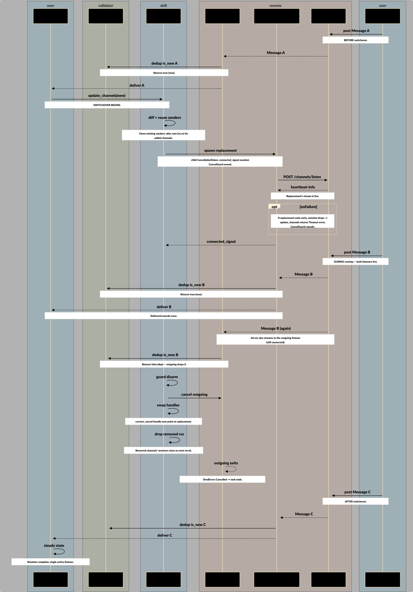


<a id="dataflow-ARCH-y63gmb1p7q"></a>

### Encrypted Channel Creation (ARCH-y63gmb1p7q)

Sign the channel name with an Ed25519 identity, include owner+signature in the create body, and rely on the server to verify the signature against the owner public key.
**Trigger**: Consumer calls DredClient::create_encrypted_channel(name, identity, options)
**Preconditions**: Caller holds an Identity (generated via Identity::generate or restored from base64)

1. **[dApp Consumer](#actors)** → **[DredClient](#dredclient-arch-f8bv876rfx)**: create_encrypted — Requires allow_joining=true or a non-empty members list.
2. **[DredClient](#dredclient-arch-f8bv876rfx)** → **[Identity](#identity-arch-6tqg5gvypa)**: sign_string(name) — Ed25519 detached signature over the channel name bytes, base64-encoded.
3. **[DredClient](#dredclient-arch-f8bv876rfx)** → **[DredClient](#dredclient-arch-f8bv876rfx)**: build options — Set encrypted=true, owner=pubkey b64, signature=sig b64.
4. **[DredClient](#dredclient-arch-f8bv876rfx)** → **[DredServer](#dredserver-arch-xakvgft09j)**: POST /channel/{name} — Server verifies signature against owner pubkey over the channel name. *(on failure: Non-2xx → ServerStatus; bad JSON → Protocol.)*
5. **[DredServer](#dredserver-arch-xakvgft09j)** → **[DredClient](#dredclient-arch-f8bv876rfx)**: CreateChannelResponse

**Postconditions**: Encrypted channel exists on the server with the caller's public key as owner; Caller can now subscribe to the channel and post messages signed for the same identity


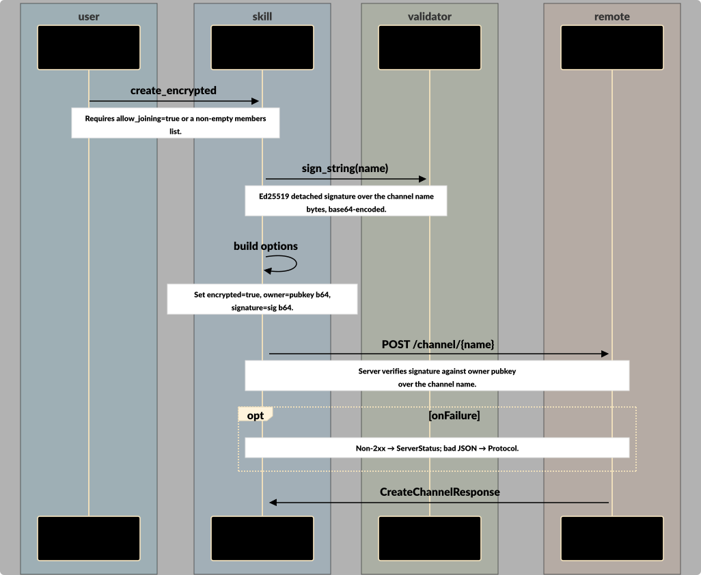


<a id="dataflow-ARCH-hfgcy3187z"></a>

### Reconnect with Exponential Backoff (ARCH-hfgcy3187z)

When a connection fails or heartbeat is missed, the listener's run loop sleeps for a backoff interval (doubling each time, capped at backoff_max) then retries. A long-lived prior connection resets the backoff.
**Trigger**: connect_once returns an error other than Cancelled
**Preconditions**: DredListener::run is active (not cancelled)

1. **[DredListener](#dredlistener-arch-afp408rkyz)** → **[DredListener](#dredlistener-arch-afp408rkyz)**: classify error — DredError variant dictates backoff handling.
2. **[DredListener](#dredlistener-arch-afp408rkyz)** → **[DredListener](#dredlistener-arch-afp408rkyz)**: adjust backoff — Reset on StreamEnded. Transport/ServerStatus: reset only if prior connection outlived backoff_max.
3. **[DredListener](#dredlistener-arch-afp408rkyz)** → **[DredListener](#dredlistener-arch-afp408rkyz)**: sleep(backoff) — select! on cancel vs sleep. *(on failure: Cancelled during sleep → DredError::Cancelled; exit run loop.)*
4. **[DredListener](#dredlistener-arch-afp408rkyz)** → **[DredListener](#dredlistener-arch-afp408rkyz)**: double backoff — (backoff * 2).min(backoff_max). 30s cap by default.
5. **[DredListener](#dredlistener-arch-afp408rkyz)** → **[DredServer](#dredserver-arch-xakvgft09j)**: POST /channels/listen
6. **[DredServer](#dredserver-arch-xakvgft09j)** → **[DredListener](#dredlistener-arch-afp408rkyz)**: NDJSON stream — Dedup suppresses any replay from the server's window.

**Postconditions**: Either a new connection is established and dedup suppresses any replay, or the listener stays in the backoff/retry loop until cancelled

**Loops**: The entire run loop repeats until the listener's CancellationToken fires


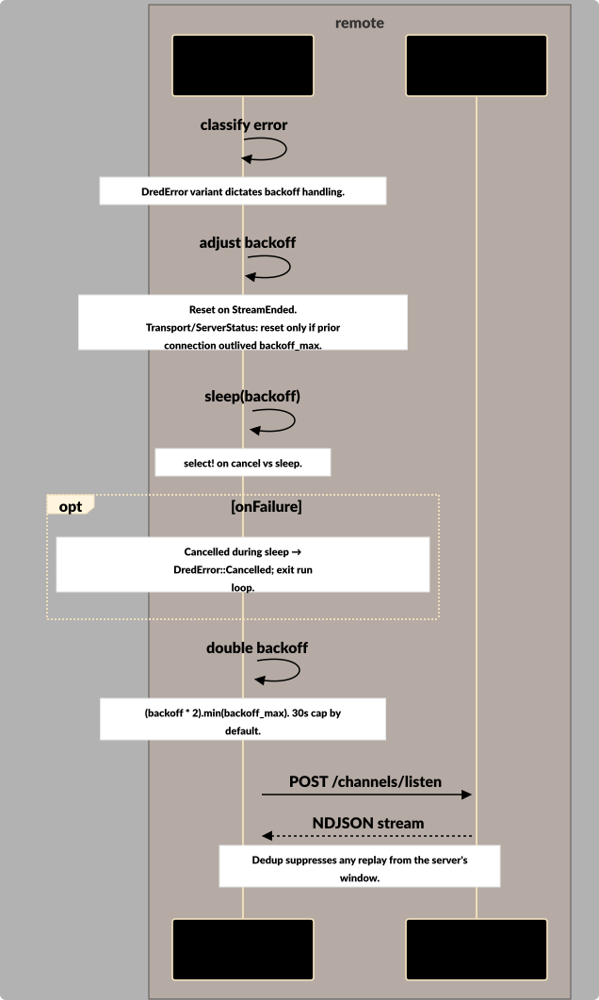


## Software Objects


### DredMessage (struct - ARCH-v314k3w11x)

**Component**: DredListener (ARCH-afp408rkyz)
**Source**: `sdc-rs/src/lib.rs`

```
struct DredMessage { mid: Option<String>, channel: Option<String>, msg_type: Option<String> (serde rename=type), nbh: Option<String>, msg: Option<serde_json::Value>, ocid: Option<String>, extra: serde_json::Map<String, Value> (serde flatten) }
```

Derives Debug + Clone + Deserialize + Serialize. Known fields are typed; everything else lands in extra via #[serde(flatten)] so forward-compatible server changes don't break the client.

**Supports Requirements**: REQT-hfmveq25qc


### DredError (enum - ARCH-f34z7ytc54)

**Component**: sdc-rs (ARCH-9bqqbc4atk)
**Source**: `sdc-rs/src/lib.rs`

```
enum DredError { Transport(reqwest::Error), ServerStatus(reqwest::StatusCode), Protocol(String), StreamEnded, Cancelled }
```

Send + Sync + 'static. Implements Display, std::error::Error, and From<reqwest::Error>. Transport preserves source() for error chaining; Protocol carries a context string.


### SharedInner (struct - ARCH-8hshn27d7c)

**Component**: DredClient (ARCH-f8bv876rfx)
**Source**: `sdc-rs/src/lib.rs`

```
struct SharedInner { base_url: String, client_id: String, http: reqwest::Client, dedup: Deduplicator, cancel: CancellationToken, backoff_initial: Duration, backoff_max: Duration, channel_buf: usize }
```

The heart of DredClient — Arc-wrapped so Client::clone() is a refcount bump and listeners hold Arc<SharedInner> directly. Bundles every piece of state that must be shared between the client and its listeners.


### DredClientBuilder (struct - ARCH-7hgr2av9yb)

**Component**: DredClient (ARCH-f8bv876rfx)
**Source**: `sdc-rs/src/lib.rs`

```
struct DredClientBuilder { base_url: String, client_id: Option<String>, dedup: Option<Deduplicator>, cancel: Option<CancellationToken>, channel_buf: usize, backoff_initial: Duration, backoff_max: Duration }
```

Builder for DredClient. Fluent setters for client_id, dedup, cancellation_token, channel_buffer, backoff. Defaults: channel_buf=256, backoff 500ms→30s. build() constructs SharedInner and wraps in Arc.


### CreateChannelOptions (struct - ARCH-k0qesdv9c1)

**Component**: DredClient (ARCH-f8bv876rfx)
**Source**: `sdc-rs/src/lib.rs`

```
struct CreateChannelOptions { encrypted: bool, allow_joining: Option<bool>, member_limit: Option<u32>, expires_at: Option<String>, message_lifetime: Option<u64>, owner: Option<String>, signature: Option<String>, members: Vec<String> }
```

Derives Serialize. Option fields skip serialization when None. owner and signature are populated automatically by create_encrypted_channel and should not be hand-set. expires_at is RFC 3339 as a string to avoid a chrono dependency.


### CreateChannelResponse (struct - ARCH-kmyfwpnttz)

**Component**: DredClient (ARCH-f8bv876rfx)
**Source**: `sdc-rs/src/lib.rs`

```
struct CreateChannelResponse { id: String, status: String, channel_id: Option<String>, members: Vec<String>, created_at: Option<String>, extra: serde_json::Map<String, Value> (serde flatten) }
```

Server response body for POST /channel/{name}. serde flatten collects any additional server-added fields. Known fields are renamed for snake_case on the Rust side.


### PostMessageResponse (struct - ARCH-xzmxkm4yf9)

**Component**: DredClient (ARCH-f8bv876rfx)
**Source**: `sdc-rs/src/lib.rs`

```
struct PostMessageResponse { id: String, status: String, ocid: String }
```

Server response body for POST /channel/{channelId}/message. id is the Redis stream id assigned by the server; ocid is the original-client-id (either caller-supplied or client-generated).


### CancelGuard (struct - ARCH-9v3zhskxzk)

**Component**: DredSubscription (ARCH-yhkfr4x56c)
**Source**: `sdc-rs/src/lib.rs`

```
struct CancelGuard { token: Option<CancellationToken> } with fn disarm(mut self) and Drop impl that cancels if token is Some
```

RAII drop guard used during DredSubscription::update_channels. Holds the new listener's CancellationToken until the rotation completes successfully; if any early return or panic occurs before disarm(), Drop cancels the token and the new listener cleans itself up.


### ChannelSubConfig (struct - ARCH-p7y70gaqej)

**Component**: DredListener (ARCH-afp408rkyz)
**Source**: `sdc-rs/src/lib.rs`

```
struct ChannelSubConfig { channel: String, options: ChannelSubOptions }; struct ChannelSubOptions { bookmark: Option<String> }
```

Wire-format structs for the POST /channels/listen request body (Serialize only). Sent as a JSON array, one entry per subscribed channel. bookmark is reserved for future replay-from-offset support (not currently set by sdc-rs).


## Decisions


### Per-channel mpsc over single channel or callbacks (accepted - ARCH:dcisn-xmwt469dtd)

**Subject**: DredListener (ARCH-afp408rkyz)

**Context**: Consumers need to receive messages from multiple channels, but different output shapes have different costs: callbacks block async work, a single mpsc forces consumers to re-dispatch, per-channel mpsc trades a bit of memory for clean per-channel ownership.

> **Situation**: The TS client uses typed event emission; a direct Rust port could have used callbacks, a single mpsc, a broadcast channel, or per-channel mpsc.
>
> **Impact**: Callbacks (impl Fn) block async consumers from doing async work in the handler. A single mpsc forces every consumer to re-dispatch by channel themselves, which is a pile of per-consumer boilerplate. A broadcast would burn memory for consumers that only want one channel.
>
> **Vision**: Each channel has its own mpsc::Receiver that the consumer takes once; the listener routes each NDJSON line to exactly one receiver; consumers write idiomatic tokio recv() loops.

DredListener owns HashMap<String, mpsc::Sender<DredMessage>>. DredSubscription owns the mirror HashMap<String, mpsc::Receiver<DredMessage>> and exposes take_receiver(channel). Channel buffer size is configurable (default 256).


**Also involves**:
- DredSubscription (ARCH-yhkfr4x56c) — DredSubscription materializes the per-channel receivers and hands them out via take_receiver
- sdc-rs (ARCH-9bqqbc4atk) — Shapes the overall consumer-facing API of the library


### Two-generation rotating dedup over unbounded HashSet (accepted - ARCH:dcisn-5n74x55ja6)

**Subject**: Deduplicator (ARCH-xqjpk4fzdg)

**Context**: A long-running connection would grow an unbounded HashSet without limit, but the client still needs to catch duplicates across reconnections and replay windows.

> **Situation**: The TS client uses the same two-generation approach in ChannelSubscriptionListener. Server-side dedup (Redis Set via ensureMessageProcessedOnce) is the authoritative guard.
>
> **Impact**: Without rotation, the set grows without bound for long-running connections. Without client-side dedup, every reconnect would redeliver the replay window to consumer callbacks.
>
> **Vision**: Bounded memory and a 30-60s dedup window, sufficient to cover any reasonable reconnect latency while the server-side Redis dedup handles strict correctness.

HashSet<String> × 2 generations. Rotation every 30s: current → previous, previous dropped. check() consults both sets, insert goes into current. Memory is capped by the traffic rate times the rotation interval.


**Also involves**:
- OCID Dedup Set (ARCH-cwg74m6207) — The concrete artifact this decision shapes — the in-memory dedup set


**Supports Requirements**: REQT-p5c4tcz2r7


### Heartbeat watchdog over TCP keepalive (accepted - ARCH:dcisn-4s2xbzdp8m)

**Subject**: DredListener (ARCH-afp408rkyz)

**Context**: Half-open TCP connections (remote host gone, no RST) need to be detected quickly, but TCP keepalive operates on a timescale of minutes.

> **Situation**: The DRED server already emits periodic heartbeat frames (every ~7s by default) on every NDJSON stream. TCP keepalive defaults on Linux are measured in minutes.
>
> **Impact**: Relying on the OS network stack means half-open connections go undetected for minutes, during which no messages flow and the consumer is silently starved.
>
> **Vision**: Application-layer heartbeat watchdog: if no heartbeat arrives within 3× the configured interval, declare the connection dead and reconnect. Detection within ~21s in the default configuration.

On heartbeat-info, set heartbeat_interval and heartbeat_deadline = now + 3×interval. On every subsequent heartbeat or message, extend the deadline. In tokio::select!, a sleep_until(deadline) branch returns DredError::StreamEnded if it fires first.


**Also involves**:
- Heartbeat Deadline (ARCH-n3mj55v36d) — The heartbeat_deadline artifact is this decision's concrete mechanism


### Poison-safe Mutex for shared Deduplicator (accepted - ARCH:dcisn-0bbg37c41t)

**Subject**: Deduplicator (ARCH-xqjpk4fzdg)

**Context**: The Deduplicator is shared across many listener tasks and reconnections via Arc<Mutex<_>>. A panic while holding the mutex poisons it — further lock().unwrap() calls panic, bricking dedup for every listener.

> **Situation**: std::sync::Mutex poisoning is the default behaviour on panic. sdc-rs uses the blocking sync::Mutex (not tokio::sync::Mutex) because holds are very short.
>
> **Impact**: If any task panics while holding the lock — even in a test or a debug callback — every subsequent check() call panics. The dedup state is lost for the entire process lifetime.
>
> **Vision**: Recover the mutex on poison, resume operating with the state as it was at the moment of the panic, log once, and keep going.

lock_or_recover helper calls mutex.lock().unwrap_or_else(PoisonError::into_inner). Every Deduplicator operation goes through this helper, including check(), len(), and is_empty().


### Arc-backed cloneable DredClient (accepted - ARCH:dcisn-b1wjmeqcq4)

**Subject**: DredClient (ARCH-f8bv876rfx)

**Context**: Rust's ownership model makes a non-Clone client awkward for async code — every task that wants to post a message needs a reference, and the connection pool / deduplicator must be shared.

> **Situation**: The original session-1 implementation had free functions with too many parameters. Session 2 extracted DredClient from DredListener.
>
> **Impact**: Without Clone, consumers would have to wrap the client in Arc themselves, or pass &DredClient through every async boundary. Every task needs its own handle to post messages, yet the state it manages must be singular.
>
> **Vision**: DredClient is cheap-to-clone (Arc bump) and can be passed freely between tasks. All state lives on SharedInner, wrapped once in Arc, owned by every client clone and every listener.

pub struct DredClient { inner: Arc<SharedInner> }. #[derive(Clone)] — Clone is a refcount increment. Listeners hold Arc<SharedInner> directly; build_listener clones the Arc. The root CancellationToken lives on SharedInner so cancelling once stops every listener.


**Also involves**:
- SharedInner (ARCH-8hshn27d7c) — SharedInner is the Arc payload
- DredListener (ARCH-afp408rkyz) — DredListener also holds Arc<SharedInner>, so it shares connection pool, dedup, and cancellation root with DredClient


## Design Patterns


## Files


## Collaboration Summary


**Uses**:
- DredServer (TypeScript) (sdc-rs talks exclusively to a DredServer over HTTP — /channels/listen for streaming, /channels for listing, /channel/{name} for creation, /channel/{ch}/message for posting. Wire format (NDJSON, StringNacl b64 signatures) matches the TS client.)

**Used by**:
- dApp application code (Rust) (Rust applications link sdc-rs as a library dependency. They construct a DredClient with DredClient::builder(url).build(), subscribe to channels, consume messages via mpsc::Receiver, and post messages. The client is Clone (Arc-backed) and freely moved across async tasks.)


## Interview Status


- **Phase**: synthesis
- **Checkpoint**: post-implementation synthesis from IMPLEMENTATION.md and source review
- **Notes**: Architecture reverse-engineered from a working, production-shaped Rust client library (47 passing tests). Source: sdc-rs/src/lib.rs (1381 lines) and sdc-rs/IMPLEMENTATION.md. Two implementation sessions already complete; this arch captures the shape that emerged.
- **Sessions**:
  - 2026-04-05 - synthesis: Authored sdc.arch.jsonl from IMPLEMENTATION.md and lib.rs — full data model including components, concerns, interactions, dataflows, software_objects, decisions, open questions, and diagram directives.


## Open Questions


- [ ] Should sdc-rs integrate multi-host discovery and connection management like the TS DredClient does, or stay single-host? *(context: The TS DredClient uses ConnectionManager and Discovery (Static or Neighborhood via Blockfrost) to maintain HostConnections across several nodes concurrently. sdc-rs currently talks to exactly one base_url. For production DRED deployments the client is expected to tolerate individual node failures by switching hosts, which sdc-rs doesn't yet do.)*

- [ ] Should DredSubscription's connect_timeout be configurable on the initial subscribe() call, not just on update_channels? *(context: Today subscribe() spawns a DredListener and returns immediately; the subscription waits for nothing. The initial listener's first connection failure is absorbed into the reconnect loop silently. update_channels has a 10s connect_timeout. There may be use cases where consumers want a bounded wait-for-connected on initial subscribe as well.)*

- [ ] Should ChannelSubOptions.bookmark be surfaced on subscribe() so consumers can replay from an offset? *(context: The wire-level ChannelSubConfig has an options.bookmark field (currently always None), matching the TS client's subscription contract. sdc-rs doesn't expose a way to pass a bookmark. If/when replay-from-offset matters to a consumer, this would have to be plumbed through DredClient::subscribe and DredSubscription::update_channels.)*

- [ ] How should mutating client operations expose idempotent semantics — treat 'already exists'/'already member' errors as success, or surface them for the caller to handle? *(context: Raised during sdc-rs audit F2 (20260405.sdc-rs.structural-review.audit-result.md) while discussing DredError::ServerStatus body exposure. Two approaches considered: (A) internal swallow of known 'already done' errors — rejected because option-mismatches (different owner, different encryption, different initial members) should NOT be hidden from the caller; (B) opt-in disposition flag on mutating API (e.g. IfExists::Ok|Error on CreateChannelOptions) — preferred guidance. Default should remain strict rejection; idempotent tolerance is opt-in so the caller explicitly declares it. Cross-cutting: the same flag belongs in the TS DredClient and must align with DredServer response semantics for similar operations like joinChannel/addMember.)*


## Discovery Notes


### Phase: current-state

Architecture reverse-engineered from a working, tested implementation. Source: sdc-rs/IMPLEMENTATION.md (written by the implementer during session 2) and sdc-rs/src/lib.rs (1381 lines, single-file library). 47 tests passing (29 unit + 16 integration + 2 doc-tests) against a live DRED server. The structure described here is what shipped, not a speculative design — hence the vetted-in-experience maturity on most records.


### Phase: components

Five roles, one surrogate. Internal roles: DredClient (shared state + API surface), DredSubscription (rotation-capable subscription handle), DredListener (streaming worker), Deduplicator (two-generation rotating set), Identity (Ed25519 sign/verify). Surrogate: DredServer from dred.arch.jsonl — present because every interaction and every dataflow crosses that boundary. CancelGuard and DredMessage are software_objects, not components: the guard is an RAII helper with no independent role, and DredMessage is a wire-format struct.


### Phase: data-flow

Five dataflows capture the library's core behaviors: inbound (NDJSON → consumer), outbound (post + pre-dedup + echo suppression), rotation (update_channels handoff), encrypted create (sign channel name), and reconnect (exponential backoff). The rotation dataflow is the library's most subtle piece — CancelGuard, connected_signal oneshot, and shared-deduplicator overlap are all in service of not losing any messages across a channel-set change.


